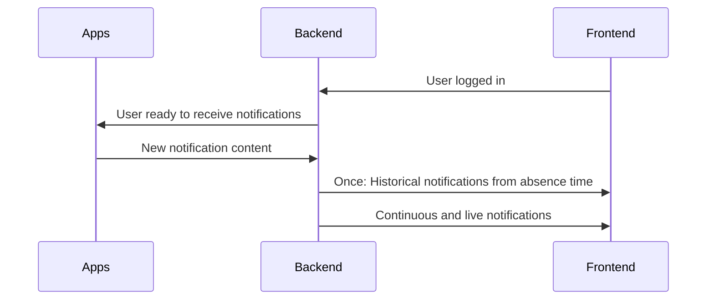

# Architecture

## Components

- **Application**

  The application eventually triggering a notification
- **MQ**, Message Queue, CQRS

  Usually RabbitMQ or MQTT-Broker that will enable sending messages asynchronically.
- **API**

  A REST-API representing the orchestrator for authorization and message dispatching.

  _Can or can not be UDM-REST-API_
- **RDMBS**, (Relational) Database
  
  A long-term persistent storage for notifications. Allows quick listing, paging and searching for notifications.

- **Socket**, Mercure, SSE/WS

  Enables a web-client to continously receive live messages via a socket mechanism.

- **Frontend**

  This can either be the Univention-Portal, but it can also be the header bar in applications
  and probably all other instances that want to show notifications


## High level control flow



- DW: Do we need the "User ready to receive notifications" or do we want to listen simply for all notifications?
  - Is it possible to try and call someone who is not logged into the portal?
    - If yes, the incoming-call info does not need to be routed if the user is not online and does not need to be persisted, either.
      It will turn into a missed call information and show up the next time the user logs in.
  - Another question is, which component keeps track of user status. Will the BE query the status from the FE somehow? I don't know if that is possible at all, since no session exists.

# Notification Trigger Process

1. **Application** calls **API** to create a new notification

   e.g.
   ```http
   POST /notifications HTTP/1.1
   Host: api.instance

   {
      "source": "cn=owncloud,cn=apps,cn=univention,dc=intranet,dc=portal,dc=de",
      "target": "cn=johndoe,cn=users,cn=univention,dc=intranet,dc=portal,dc=de",
      "title": "Jane is calling you!",
      "message": "Press \"Accept\" or \"Reject\" to answer the call.",
      "expireTime": "2022-10-10T12:35Z-02:00"
      "type": "call",
      "acceptUrl": "https://call.univention.de/join?sessionToken=abcdef",
      "rejectUrl": "https://api.univention.de/reject-call?sessionToken=abcdef"
   } 
2. **API** fills out the rest of the data and
   1. **either** sends it to the MQ (`Client-Mode`)
   2. **or** continues on Step 4. (`Listener-Mode`)
3. **API** listens on MQ channel and continously receives new notifications from MQ
4. **API** takes received Notifications and
   1. Persists them in the database
   2. Sends them to the **Socket** for the web-frontend to receive it live

# Frontend Process

1. On load, **Frontend** requests a quick view of the notifications

   ```http
   GET /notifications?query=latest HTTP/1.1
   Host: api.instance
   ```

   It will receive an array of existing notifications

   **API** will make sure that the user can only request notifications their DN fits in
2. **Frontend** connects **Socket** to continously receive new notifications
3. **Frontend** will connect to all applications it knows/displays badges for and calls

   ```http
   GET /.well-known/univention-meta.json HTTP/1.1
   Host: <the application host>
   ```

   and receives (if available) a meta information to display proper badge information

   ```http
   HTTP/1.1 200 OK
   Content-Type: application/json

   {
    "name": "Open Exchange",
    "badgeLabel": "244",
    "badgeDescription": {
        "de_DE": "244 ungelesene E-Mails",
        "en_GB": "244 unread e-mails"
    }
   }
   ```

   This meta-info can be cached properly.
4. Depending on `type`, the **Frontend** displays the proper notification view
5. When going to the notification dashboard, **Frontend** calls **API** to receive and filter _all_ notifications


## Initial notifications 

- initial notifications (especially status messages) to get from the app by means of an .well_known endpoint who provides zero state information (this is necessary for information that is related to the tiles - number of unread emails, etc.)
