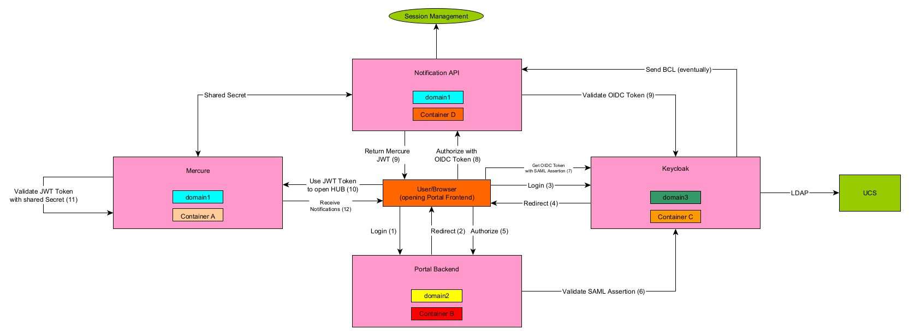
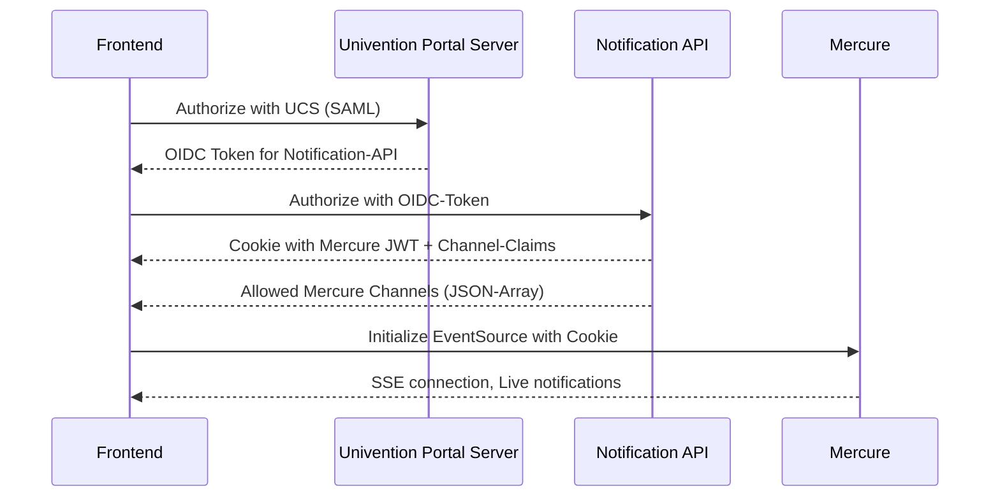
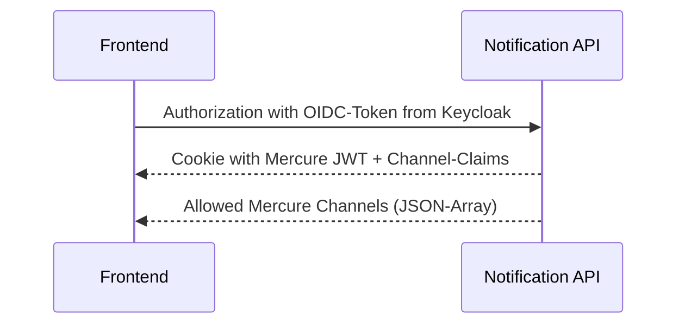
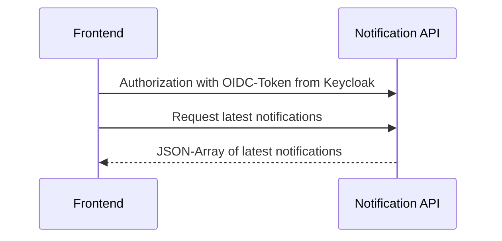
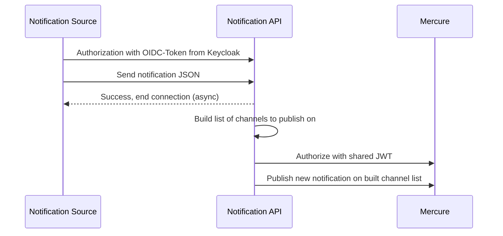
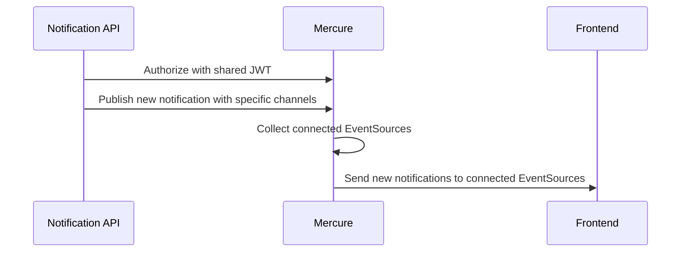
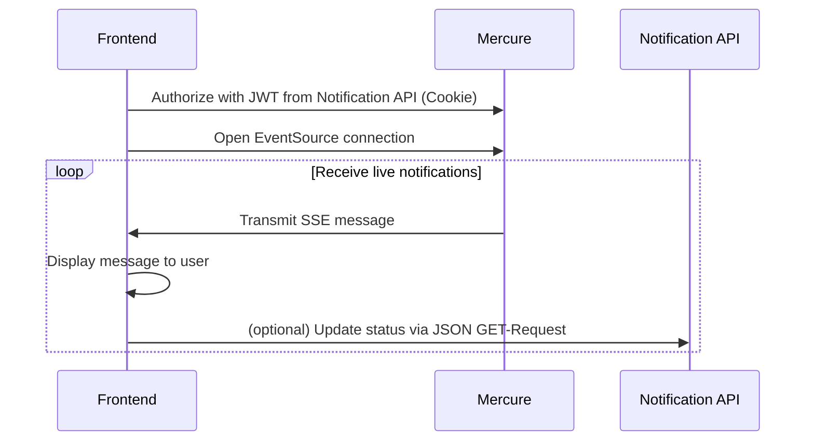

# Mercure Authorization Concept

Complete authorization flow overview:



## Frontend View

1. User opens Frontend
2. Frontend authorizes normally and receives:
   - The usual univention cookie
   - Another "mercureAuthorization"-Cookie which contains a JWT for Mercure with
     a JWT claim called `mercure` with the content `{"subscribe":["<url to hub>", "<url to hub>"]}`

     Notice these `publish`-URLs are not read by the frontend itself (It's a HTTP-Only cookie)
3. Frontend requests an endpoint, e.g. `/api/hubs`, to know which hubs it can connect to
4. Frontend opens `EventSource` on all Hub URLs. It creates a request which won't stop and
   will contain `mercureAuthorization` cookie to tell Mercure which channels it has access to



> SKF: How does the Frontend authenticate with the Notification API?

## Backend View (Notification API)

1. User authorizes and receives application cookie
   - Backend will retrieve user and respective groups and build a Mercure hub url for each one
 
     e.g. User A is in Groups Group A, Group B and Group C, user will receive Hub-URLs
 
     ```
     https://hub.notifications.univention.de/users/user-a
     https://hub.notifications.univention.de/groups/group-a
     https://hub.notifications.univention.de/groups/group-b
     https://hub.notifications.univention.de/groups/group-c
     ```
   - Cookie is HTTP-only and placed on a sub-domain that Mercure and the backend share (See Mercure View)
2. User requests a list of all allowed Mercure Hub URLs, so the cookie won't be the only place
   where the backend needs to know all Hub-URLs for a specific user (Frontend can't read the HTTP-only cookie)
3. When Backend sends a message to Mercure, it needs to authenticate with a proper, valid JWT for Mercure with a JWT claim called `mercure` with the content `{"publish":["<url to hub>", "<url to hub>"]}`

When Frontend initially wants to connect



When frontend requests latest notifications


When backend wants to forward a new notification to the user



## Mercure View

1. Mercure is configured with:
   - `ALLOW_ANONYMOUS=0` to disallow anonymous connections
2. Mercure is configured with a JWT_SECRET/JWT_KEY that the backend knows of
3. Backend and Mercure share the same sub-domain on which the HTTP-Cookies are placed, e.g.
   
   `https://notifications.univention.de` and `https://hub.notifications.univention.de`, cookies would be placed
   on the domain `.hub.notifications.univention.de`

   This is important als otherwise the cookie placed by the backend can't be consumed by Mercure
   
On publish:



On subscribe:


