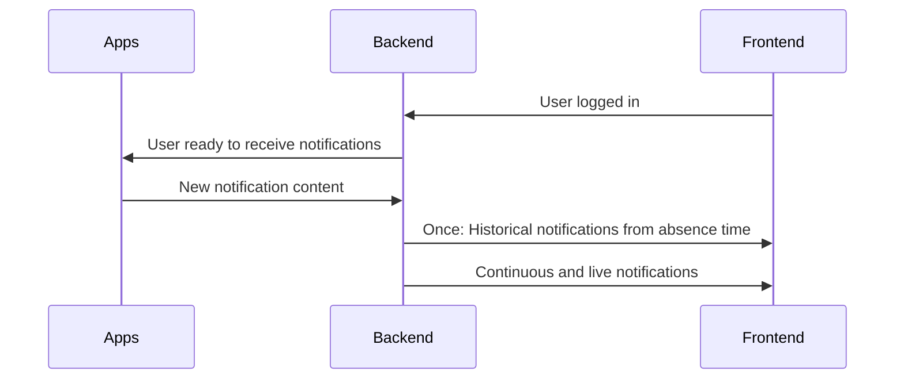

# Notifications in Univention Portal

## Use Cases

- Information from Applications
  - Number of unread messages
  - Incoming call
  - Meeting reminder
  - Incoming e-mail
  - Incoming chat message
  - Document change (creation, update, deletion)
- Information from the organization
- Administrator information
  - Information on software updates
  - Information on downtimes

## Requirements

- Notifications should be real-time
- Notifications can be status messages 
  - Circle above Tiles
- Notifications can be announcements
  - Bar at the top
- Notifications can be events
  - List of speech-bubbles at the side, when opening the bell icon (event tray)
- Certain announcements must be hideable
- When a user logs in, the last n notifications from history must be populated
- Announcements must come in different styles per severity
  - Severity can be info, alert, emergency
- Announcement validity
  - Announcements can become relevant/visible at a certain time
  - Announcements can expire/will be removed at a certain time
  - Validity must consider the timezone in that ... (to be further specified if this is really relevant)
- An event must be visible for a certain time until it hides in the event tray
- Delivery of notifications must be filtered by access control lists derived from LDAP group memberships
- Notifications must not be accessible by unauthorized users
- Notifications will be visible on any client, the user is logged in with
  - Visual representation might need to be adapted to the clients visual capabilities
- Notifications must have the necessary attributes for beeing uttered by the screen reader

## High Level Architecture

## Open Questions
