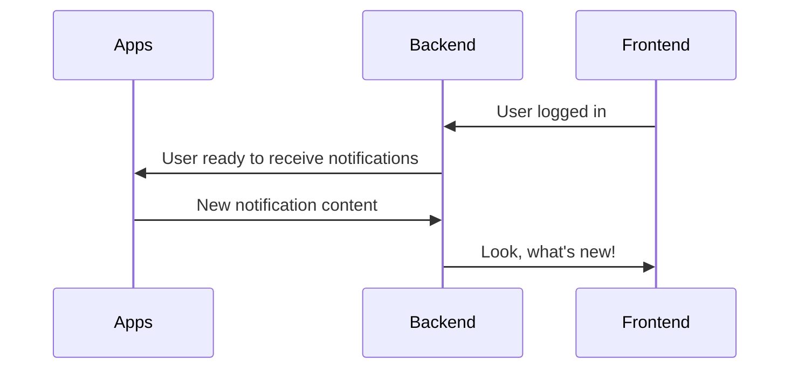

# Notifications in Univention Portal

## Use Cases

## High Level Architecture

```mermaid

sequenceDiagram
    participant Apps
    participant Backend
    participant Frontend
    Frontend->>Backend: User logged in
    Backend->>Apps: User ready to receive notifications
    Apps->> Backend: New notification content
    Backend->>Frontend: Look, what's new!

```

## Open Questions