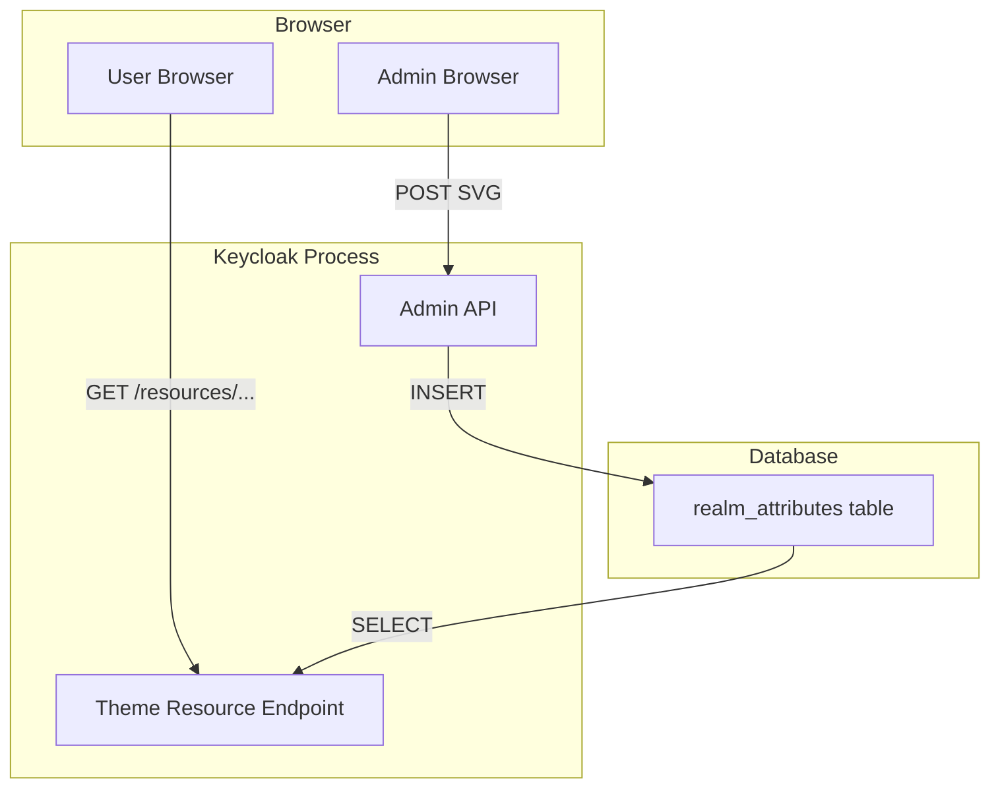
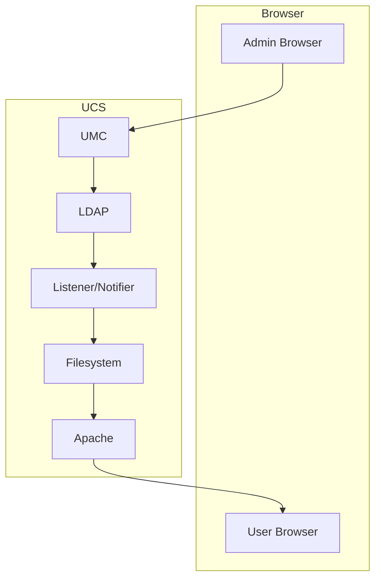
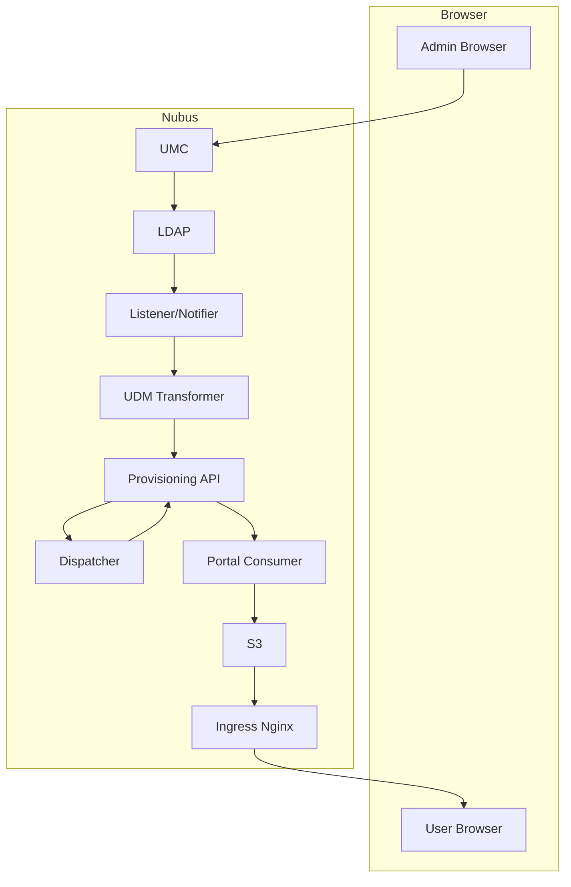

# Changing an svg image, A story of accidental complexity

We often ask ourselves why Nubus is hard to develop, maintain, deploy and operate.
This is an attempt to give a few insights into this problem.
It's by no means a complete analysis
but instead just a small snapshot.

Today I'd like to tell you a story about a login.svg and a logo.svg file
and their journey through the systems of their respective products.

The Journey starts when an Administrator uploads an svg image
to customize the end-user experience and ends when the svg image is served to users.

For Keycloak the protagonist is the logo.svg in the Login UI.
For UCS / Nubus for Kubernetes, the protagonist is the login.svg of the Login Portal tile.

Below, you can find detailed diagrams and tables of the data flow through the three system.
But first, we must continue the story.

Keycloak implements the feature in 2 container images with 4 Applications, uses 4 HTTP Requests and saves the data to 1 location (Database).

UCS implements the feature in 6 processes with 9 applications, uses 6 Requests and saves the data to 3 locations (Database, Cache, File).

Nubus for Kubernetes implements the feature in 12 container images, uses 13 HTTP Requests
and saves the data to 7 locations (Database, Queue, Cache, File).

I'm currently investigating this topic in a [Spike Issue](link) with two triggers:
- We need to remove our dependency on Minio (in maintenance-mode / deprecated)
- We need to remove our dependency on ingress-nginx (deprecated)

Our least-bad short-term option is to replace Minio with two new Applications and two new persistence locations:
- PostgreSQL
- portal-asset-loader

Database requests and Filesystem writes are treated as equivalent to one HTTP Request.

| System | Requests | Storage Locations | Containers | Applications |
|--------|----------|-------------------|------------|--------------|
| Keycloak | 5 | 1 | 2 | 4 |
| UCS | 6 | 3 | 6 | 9 |
| Nubus | 14 | 7 | 12 | 13 |
| Nubus Future | 15 | 8 | 12 | 13 |

---

## Keycloak Flow

**Requests (5):**
- Admin Browser -> Keycloak Admin API
- Keycloak Admin API -> Database
- User Browser -> Keycloak Theme Resource Endpoint
- Database -> Keycloak Login
- Browser -> Ingress Nginx → Keylcoak Login

**Storage Locations (1):**
- Database (realm_attributes table)

**Containers (2) / Applications (4):**
- Keycloak
  - Admin UI
  - Admin REST API
  - Login Page (Server-Side Rendering)
- PostgreSQL

---

## UCS Flow

**Requests (6):**
- Browser -> UMC
- UMC -> LDAP
- Listener -> Notifier
- Listener -> LDAP
- Listener -> Filesystem
- Browser -> Apache

**Storage Locations (3):**
- LDAP
- Listener Cache
- Filesystem

**Processes (6) / Applications (9):**
- Apache
  - Portal Frontend
  - UMC Frontend
- Portal Server
- UMC Server
  - UDM
- LDAP
- Notifier
- Listener

---

## Nubus Flow

**Requests (14):**
- Browser -> UMC
- UMC -> LDAP
- Listener -> Notifier
- Listener -> LDAP
- Listener -> Nats (ldap-producer queue)
- Nats -> UDM Transformer
- UDM Transformer -> Old Cache (Nats)
- UDM Transformer -> Provisioning API (/messages)
- Provisioning API -> Nats (incoming queue)
- Nats -> Dispatcher
- Dispatcher -> Nats (portal-consumer queue)
- Nats -> Portal Consumer
- Portal Consumer -> S3
- Browser -> Ingress Nginx → S3

**Storage Locations (7):**
- LDAP
- Listener Cache
- Nats (ldap-producer queue)
- Old Cache (Nats)
- Nats (incoming queue)
- Nats (portal-consumer queue)
- S3

**Containers (12) / Applications (13):**
- Portal Frontend
- Portal Server
- UMC Frontend
- UMC Server
  - UDM
- LDAP Server
- Notifier
- Listener
- NATS
- UDM Transformer
- Provisioning API
- Portal Consumer
- Minio (S3)

# How we ended up here

I haven't been here for all of Univention's history so please forgive me any slight inaccuracies.

In the beginning there was an Administration UI, The UMC and it was good.
A UMC Server and a UMC Frontend. This is equivalent to the Keycloak Admin UI and Keycloak admin rest api.

In Nubus these are two separate Containers / Processes. Keycloak has only one:
-> Promising pattern 1: The backend API web server also serves the static files for it's frontend.

Then an en-user Portal was added. Implemented in the Portal Server and Portal Frontend.
The Portal is configured via UDM through the UMC-UDM UI. The configuration is written to LDAP.
But OpenLDAP does not have native change event mechanism equivalent to PostgreSQL NOTIFY/Listen or NATS Pub/Sub.
We could have polled the subtree ETAG (entryCSN) in LDAP.
Instead used the Listener/Notifier mechanism to run a listener module that recieves the LDAP changes and writes the assets and config to the local filesystem. (portal.json, groups.json, login.svg...)
The assets are served by the Apache web server. The config is read by the Portal Server.
-> Promising pattern 1: Applies here aswell
-> Promising pattern 2: Native change event support is important.
-> Promising pattern 3: Polling is sometimes good enough.

