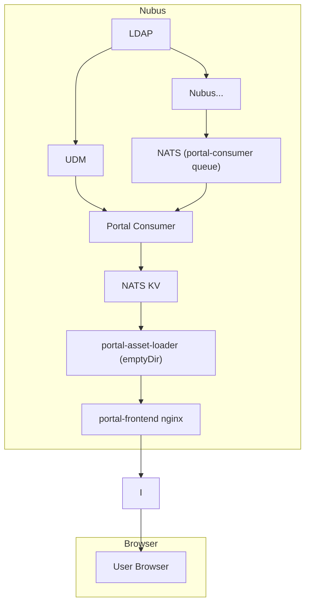
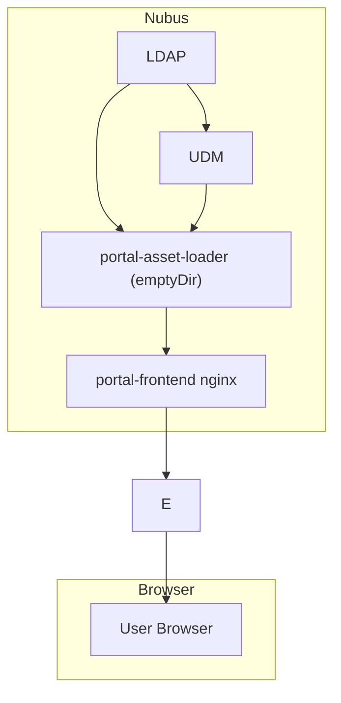

# Milestone 1: Simplifying the Portal Asset Pipeline

Current implementation: Portal-Consumer writes assets to S3.
Assets are served directly from S3 via Ingress-Nginx rewrites.

The portal-consumer does not actually use the provisioning message.
It just evaluates the dn and triggers a reload of all assets when something changed.

## Goal

Server the portal assets from the portal-frontend Nginx container.
Problem: How to get the portal assets to Nginx?

Solution: Sidecar container that waches for changes in LDAP and writes them to a shared emptyDir Volume.

New problem: How can the sidecar container watch for LDAP changes?

## Option 1

Deploy the portal-consumer as a sidecar container to the portal-frontend pod.

The portal-frontend can scale up and down.
-> We have a dynamic number of portal-consumer sidecar containers.
Nats streams support multiple dynamic subscribers on the same queue.
But the provisioning API does not expose this capability.

Revised implementation idea: Simple nats stream with just the dn of changed objects.

## Option 2

Keep the one portal-consumer, write the assets to another database.
A new sidecar container reads the assets from the new database
and writes them to the shared emptyDir volume.

The additional database can be Nats KV or Postgres.

## Option 3

Why is this so complicated?

We just need a notification if anything changes
in the LDAP subtree below: `cn=portal,cn=portals,cn=univention,dc=univention-organization,dc=intranet`

If a change is detected, we load the portal assets from UDM and save them to an emptyDir volume.

Let's keep it simple and just poll the entryCSN (ETAG) of the subtree every minute / 5 minutes.

---

## Comparison

| Option | Requests | Storage Locations | Containers |
|--------|----------|-------------------|------------|
| Current Nubus | 13 | 7 | 12 |
| Option 2 (NATS KV) | 15 | 8 | 9 |
| Option 3 (Polling) | 6 | 2 | 4 |

### Option 2
**Storage Locations (8):**
- LDAP
- Listener Cache
- Nats (ldap-producer queue)
- Old Cache (Nats)
- Nats (incoming queue)
- Nats (portal-consumer queue)
- NATS KV
- emptyDir

**Containers (9):**
- LDAP Server
- Notifier
- Listener
- NATS
- UDM Transformer
- Provisioning API
- Portal Consumer
- portal-asset-loader (sidecar)
- portal-frontend (nginx)

**Requests (15):**
- Listener -> Notifier
- Listener -> LDAP
- Listener -> Nats
- NATS -> UDM Transformer
- UDM Transformer -> Old Cache (Nats)
- UDM Transformer -> Provisioning API (/messages)
- Provisioning API -> Nats (incoming queue)
- Nats -> Dispatcher
- Dispatcher -> Nats (portal-consumer queue)
- Nats -> Portal Consumer
- Portal Consumer -> UDM REST API
- UDM REST API -> LDAP
- Portal Consumer -> NATS KV
- Nats KV -> portal-asset-loader (sidecar)
- portal-asset-loader -> emptyDir Volume

### Option 3

**Storage Locations (2):**
- LDAP
- emptyDir

**Containers (4):**
- LDAP Server
- UDM REST API
- portal-asset-loader (sidecar)
- portal-frontend (nginx)

*Requests (5):**
- portal-asset-loader -> LDAP
- portal-asset-loader -> UDM REST API
- UDM REST API -> LDAP
- portal-asset-loader -> emptyDir Volume

### Current Nubus
**Storage Locations (7):**
- LDAP
- Listener Cache
- Nats (ldap-producer queue)
- Old Cache (Nats)
- Nats (incoming queue)
- Nats (portal-consumer queue)
- S3

**Containers (8):**
- LDAP Server
- Notifier
- Listener
- NATS
- UDM Transformer
- Provisioning API
- Portal Consumer
- S3

**Requests (13):**
- Listener -> Notifier
- Listener -> LDAP
- Listener -> Nats
- NATS -> UDM Transformer
- UDM Transformer -> Old Cache (Nats)
- UDM Transformer -> Provisioning API (/messages)
- Provisioning API -> Nats (incoming queue)
- Nats -> Dispatcher
- Dispatcher -> Nats (portal-consumer queue)
- Nats -> Portal Consumer
- Portal Consumer -> UDM REST API
- UDM REST API -> LDAP
- Portal Consumer -> S3
