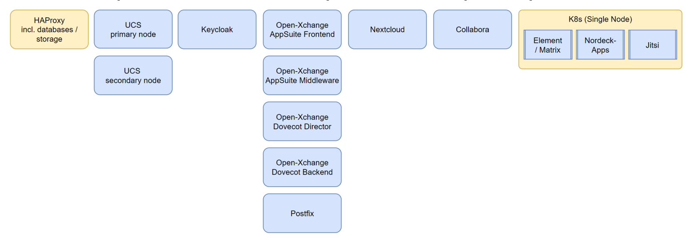

# Epic 409 Clarifications

See <https://git.knut.univention.de/groups/univention/-/epics/409> regarding the Epic itself.

This section logs notes regarding various topics which we managed to clarify
during the journey.

## Reference Kubernetes configuration from SCS project

At the moment this topic can be put aside. The SCS project will eventually come
up with a specific Kubernetes configuration. At that point in the future the
container will have to be tested in this environment and potentially be adjusted
depending on the test results.

## Environment

The current classic [deployment environment](pointers.md#souvap-integration-environment) looks roughly as follows:

Source:
[Souvereign Workplace (SouvAP).pptx](https://filestore.knut.univention.de/owncloud/f/3931975)

This environment does contain the classic setup as shown above, this means there
is a bunch of Virtual Machines which do reflect the UCS system and there is a
single node Kubernetes cluster. The portal containers would go into this
Kubernetes cluster.

Note: There is work on a 2nd generation deployment. The idea is that this would
be fully managed through Kubernetes. The virtual machines would be handled via
`kube-virt`. See the presentation linked above regarding more details.
