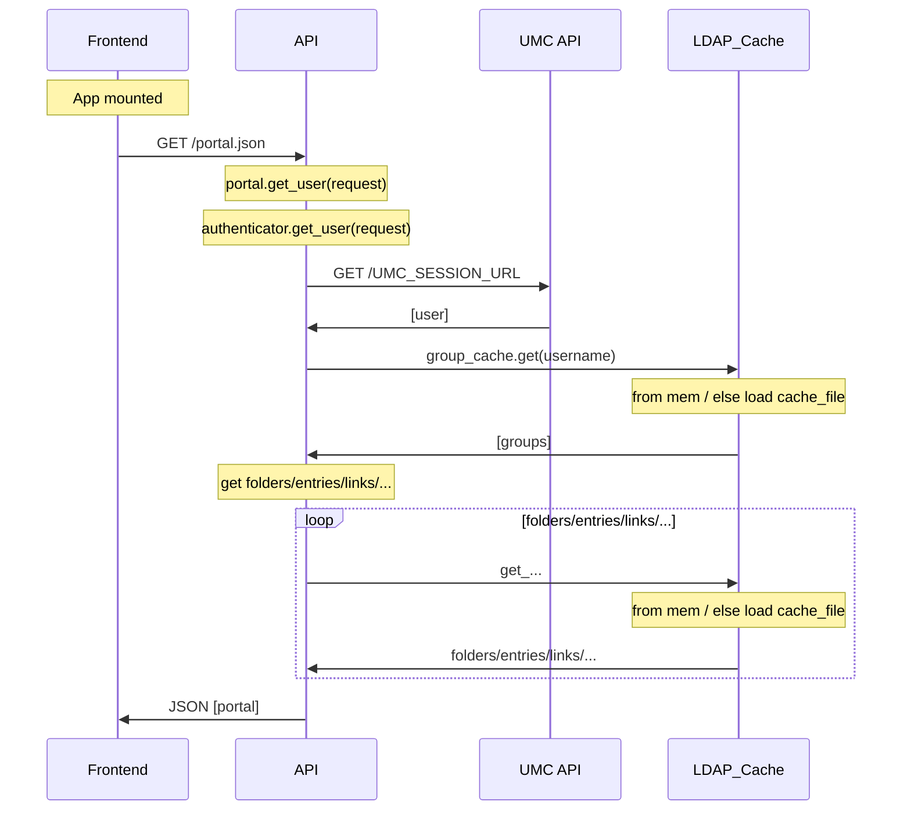

# Portal authentication

```mermaid
sequenceDiagram
    participant F as Frontend
    participant A as API
    participant U as UMC API
    participant C as LDAP_Cache
    Note over F: App mounted
    F ->> A: GET /portal.json
    Note over A: portal.get_user(request)
    Note over A: authenticator.get_user(request)
    A ->> U: GET /UMC_SESSION_URL
    U ->> A: [user]
    A ->> C: group_cache.get(username)
    Note over C: from mem / else load cache_file
    C ->> A: [groups]
    Note over A: get folders/entries/links/...
    loop folders/entries/links/...
        A ->> C: get_...
        Note over C: from mem / else load cache_file
        C ->> A: folders/entries/links/...
    end
    A ->> F: JSON [portal]
```