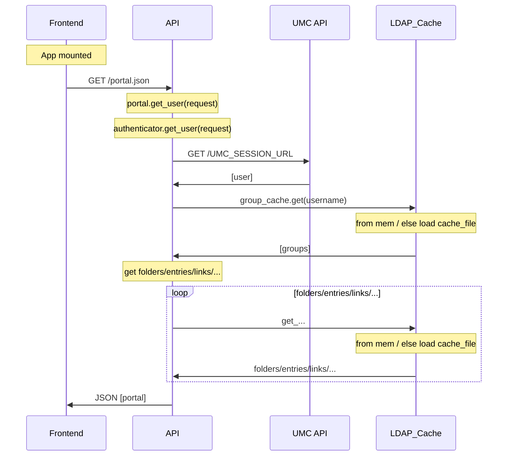
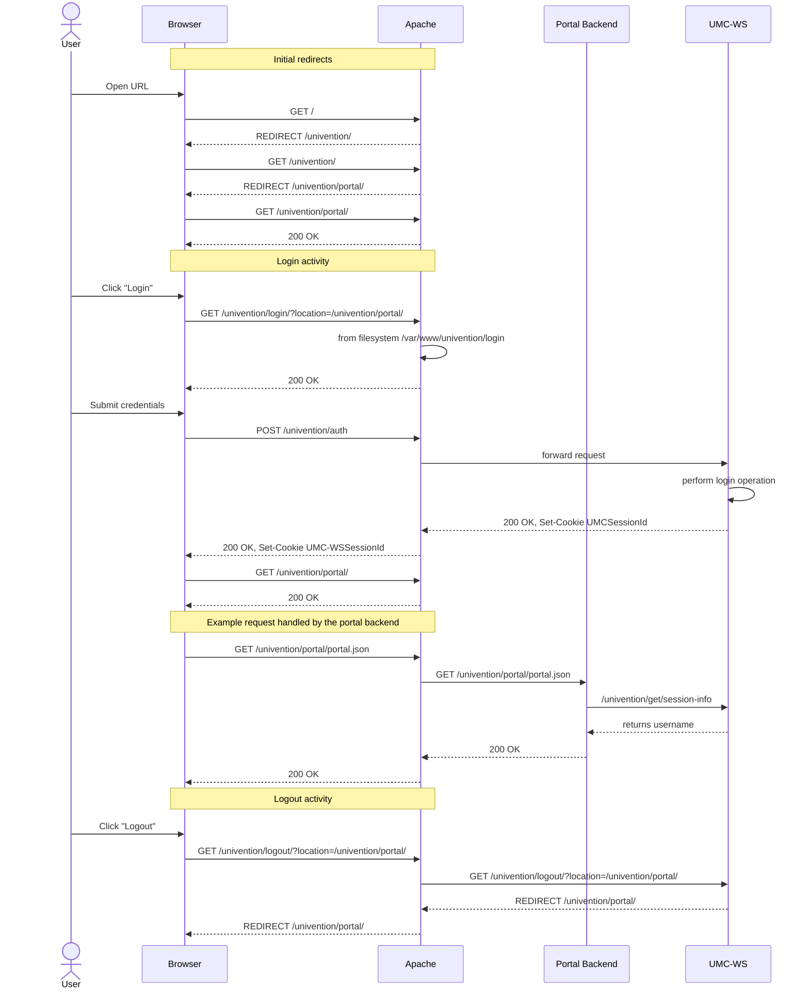

# Portal authentication





## Current authentication flow

The following diagrams show views on the current authentication flow when the
portal is installed into a UCS system.

After the "Login activity" we see the following important activities:

1. `POST /univention/auth`

    This is handled outside of the portal. This request is forwarded to the
    `UMC-WS`.

    This activity populates the cookie `UMCSessionId` which is used later.

2. `GET /univention/portal/portal.json`

    This request reaches the `Portal Backend` and it does contain the session
    cookie `UMCSessionId`.

    The `Portal Backend` itself is now making a request to `UCS-WS` and includes
    the session cookie. The `UCS-WS` can find out if the session is valid and
    also find the username. It does pass this information back to the portal.





On the UCS system we see the following Python based processes running:

```
root@ucs-3058:~#  ps aux | grep python
root      2597  0.0  3.2 239372 67216 ?        S    05:20   0:02 /usr/bin/python3 /usr/sbin/univention-management-console-server start
root      2632  0.3  3.1 1014420 65248 ?       Sl   05:20   0:14 /usr/bin/python3 /usr/sbin/univention-management-console-web-server start
root      4705  0.0  0.0   6404   836 pts/0    S+   06:27   0:00 grep python
root     29088  0.0  0.2 160948  4672 ?        Ss   Nov03   0:00 /usr/bin/python3 -m univention.admin.rest.server
root     29106  0.0  0.1 316464  3040 ?        Sl   Nov03   0:23 /usr/bin/python3 -m univention.admin.rest.server   # multiprocessing manager
root     29123  0.0  0.2 174096  4688 ?        S    Nov03   0:00 /usr/bin/python3 -m univention.admin.rest -l en_US.UTF-8 -c 1 -s /var/run/univention-directory-manager-rest-en-us.socket
root     29124  0.0  0.2 174888  4732 ?        S    Nov03   0:00 /usr/bin/python3 -m univention.admin.rest -l de_DE.UTF-8 -c 1 -s /var/run/univention-directory-manager-rest-de-de.socket
root     29158  0.0  0.1 311120  3016 ?        Sl   Nov03   0:19 /usr/bin/python3 -m univention.admin.rest -l en_US.UTF-8 -c 1 -s /var/run/univention-directory-manager-rest-en-us.socket   # multiprocessing manager
root     29168  0.0  0.1 311404  2964 ?        Sl   Nov03   0:19 /usr/bin/python3 -m univention.admin.rest -l de_DE.UTF-8 -c 1 -s /var/run/univention-directory-manager-rest-de-de.socket   # multiprocessing manager
root     32683  0.0  0.8 456060 16800 ?        Ssl  Nov03   0:01 /usr/bin/python3 /usr/sbin/univention-portal-server
```


Apache configuration snippets:


```
<LocationMatch "^/univention/saml/">
        Header always setifempty "Content-Security-Policy" "frame-ancestors 'self';"

</LocationMatch>

<LocationMatch "^/univention/management/.*">
        Header always setifempty "Content-Security-Policy" "default-src 'self' 'unsafe-eval'; script-src 'self' 'unsafe-inline' 'unsafe-eval' https://www.youtube.com/ https://s.ytimg.com/ https://www.piwik.univention.de/ https://ucs-sso.univention.intranet/ http://ucs-sso.univention.intranet/; object-src 'self'; style-src 'self' 'unsafe-inline'; img-src data: *; media-src *; frame-src *; font-src 'self'; connect-src 'self' https://ucs-sso.univention.intranet/ http://ucs-sso.univention.intranet/; form-action 'self'; frame-ancestors 'self' https://ucs-sso.univention.intranet/ http://ucs-sso.univention.intranet/; "

</LocationMatch>
```


```
ProxyPassMatch "^/univention/((auth|saml|get|set|command|upload|logout)/?.*)$" http://127.0.0.1:8090/$1 retry=0 timeout=311
ProxyPassReverse "^/univention/((auth|saml|get|set|command|upload|logout)/?.*)$" http://127.0.0.1:8090/


ProxyPass /univention/udm/ http://127.0.0.1:9979/udm/ retry=0

ProxyPassMatch /(univention/portal/.*) http://127.0.0.1:8095/$1 retry=0
ProxyPassMatch /(univention/umc/.*) http://127.0.0.1:8095/$1 retry=0

```

Etherpad configuration (App Center):

```
# generated by etherpad-lite join script, do not edit manually

RewriteEngine On
ProxyPreserveHost On
RequestHeader set X-Forwarded-Proto "https"
RewriteCond %{QUERY_STRING} transport=websocket    [NC]
RewriteCond %{REQUEST_URI} ^/etherpad/socket.io
RewriteRule /etherpad/(.*) ws://127.0.0.1:9001/socket.io/$1 [P,L]
ProxyPass /etherpad/ http://127.0.0.1:9001/ retry=0
ProxyPassReverse /etherpad/ http://127.0.0.1:9001/
```


ucs-sso.univention.intranet is a SAML provider based on simplesaml


Figure out who's listening on port 8090:

```
root@ucs-3058:/etc/apache2# lsof -i | grep LISTEN | grep 8090
univentio  2632     root    9u  IPv4 1065186      0t0  TCP localhost:8090 (LISTEN)
root@ucs-3058:/etc/apache2# ps aux -q 2632
USER       PID %CPU %MEM    VSZ   RSS TTY      STAT START   TIME COMMAND
root      2632  0.3  3.1 1014420 65248 ?       Sl   05:20   0:19 /usr/bin/python3 /usr/sbin/univention-management-console-web-server start
    ```
