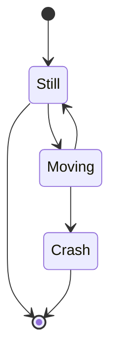

# Overview

<svg xmlns="http://www.w3.org/2000/svg" xmlns:xlink="http://www.w3.org/1999/xlink" version="1.1" width="981px" viewBox="-0.5 -0.5 981 551" style="max-width:100%;max-height:551px;"><defs><clipPath id="mx-clip-228-208-100-26-0"><rect x="228" y="208" width="100" height="26"/></clipPath><clipPath id="mx-clip-228-234-100-26-0"><rect x="228" y="234" width="100" height="26"/></clipPath><clipPath id="mx-clip-228-260-100-26-0"><rect x="228" y="260" width="100" height="26"/></clipPath></defs><g><path d="M 0 48 L 0 0 L 980 0 L 980 48" fill="rgb(255, 255, 255)" stroke="rgb(0, 0, 0)" stroke-miterlimit="10" pointer-events="all"/><path d="M 0 48 L 0 550 L 980 550 L 980 48" fill="none" stroke="rgb(0, 0, 0)" stroke-miterlimit="10" pointer-events="none"/><path d="M 0 48 L 980 48" fill="none" stroke="rgb(0, 0, 0)" stroke-miterlimit="10" pointer-events="none"/><g fill="rgb(0, 0, 0)" font-family="Helvetica" font-weight="bold" pointer-events="none" text-anchor="middle" font-size="32px"><text x="489.5" y="38.5">UCS Host</text></g><path d="M 30 465 L 50 424 L 570 424 L 550 465 Z" fill="rgb(255, 255, 255)" stroke="rgb(0, 0, 0)" stroke-miterlimit="10" pointer-events="none"/><g transform="translate(-0.5 -0.5)"><switch><foreignObject pointer-events="none" width="100%" height="100%" requiredFeatures="http://www.w3.org/TR/SVG11/feature#Extensibility" style="overflow: visible; text-align: left;">

Docker Runtime

</foreignObject><text x="59" y="451" fill="rgb(0, 0, 0)" font-family="Helvetica" font-size="20px">Docker Runtime</text></switch></g><rect x="190" y="150" width="380" height="270" fill="rgb(255, 255, 255)" stroke="rgb(0, 0, 0)" pointer-events="none"/><g transform="translate(-0.5 -0.5)"><switch><foreignObject pointer-events="none" width="100%" height="100%" requiredFeatures="http://www.w3.org/TR/SVG11/feature#Extensibility" style="overflow: visible; text-align: left;">

portal-backend

</foreignObject><text x="380" y="169" fill="rgb(0, 0, 0)" font-family="Helvetica" font-size="12px" text-anchor="middle">portal-backend&#xa;</text></switch></g><path d="M 84 150 L 84 124 L 633.7 124" fill="none" stroke="#ffffff" stroke-width="3" stroke-miterlimit="10" pointer-events="none"/><path d="M 640.45 124 L 631.45 128.5 L 633.7 124 L 631.45 119.5 Z" fill="#ffffff" stroke="#ffffff" stroke-width="3" stroke-miterlimit="10" pointer-events="none"/><rect x="54" y="150" width="120" height="270" fill="rgb(255, 255, 255)" stroke="rgb(0, 0, 0)" pointer-events="none"/><g transform="translate(-0.5 -0.5)"><switch><foreignObject pointer-events="none" width="100%" height="100%" requiredFeatures="http://www.w3.org/TR/SVG11/feature#Extensibility" style="overflow: visible; text-align: left;">

portal-frontend

</foreignObject><text x="114" y="169" fill="rgb(0, 0, 0)" font-family="Helvetica" font-size="12px" text-anchor="middle">portal-frontend</text></switch></g><rect x="30" y="471" width="920" height="60" fill="rgb(255, 255, 255)" stroke="rgb(0, 0, 0)" pointer-events="none"/><path d="M 244 486 L 244 420.84" fill="none" stroke="#00cc66" stroke-width="5" stroke-miterlimit="10" pointer-events="none"/><path d="M 244 412.59 L 249.5 423.59 L 244 420.84 L 238.5 423.59 Z" fill="#00cc66" stroke="#00cc66" stroke-width="5" stroke-miterlimit="10" pointer-events="none"/><rect x="201.5" y="486" width="85" height="30" rx="4.5" ry="4.5" fill="rgb(255, 255, 255)" stroke="rgb(0, 0, 0)" pointer-events="none"/><g transform="translate(-0.5 -0.5)"><switch><foreignObject pointer-events="none" width="100%" height="100%" requiredFeatures="http://www.w3.org/TR/SVG11/feature#Extensibility" style="overflow: visible; text-align: left;">

GDB

</foreignObject><text x="244" y="507" fill="rgb(0, 0, 0)" font-family="Helvetica" font-size="20px" text-anchor="middle">GDB</text></switch></g><path d="M 669 107.5 C 641 107.5 634 135 656.4 140.5 C 634 152.6 659.2 179 677.4 168 C 690 190 732 190 746 168 C 774 168 774 146 756.5 135 C 774 113 746 91 721.5 102 C 704 85.5 676 85.5 669 107.5 Z" fill="rgb(255, 255, 255)" stroke="rgb(0, 0, 0)" stroke-miterlimit="10" pointer-events="none"/><g transform="translate(-0.5 -0.5)"><switch><foreignObject pointer-events="none" width="100%" height="100%" requiredFeatures="http://www.w3.org/TR/SVG11/feature#Extensibility" style="overflow: visible; text-align: left;">

UMC-API

</foreignObject><text x="704" y="139" fill="rgb(0, 0, 0)" font-family="Helvetica" font-size="12px" text-anchor="middle">UMC-API</text></switch></g><path d="M 223.5 208 L 223.5 182 L 331 182 L 331 208" fill="none" stroke="rgb(0, 0, 0)" stroke-miterlimit="10" pointer-events="none"/><path d="M 223.5 208 L 223.5 286 L 331 286 L 331 208" fill="none" stroke="rgb(0, 0, 0)" stroke-miterlimit="10" pointer-events="none"/><path d="M 223.5 208 L 331 208" fill="none" stroke="rgb(0, 0, 0)" stroke-miterlimit="10" pointer-events="none"/><g fill="rgb(0, 0, 0)" font-family="Helvetica" pointer-events="none" text-anchor="middle" font-size="20px"><text x="276.75" y="203.5">API</text></g><g fill="rgb(0, 0, 0)" font-family="Helvetica" pointer-events="none" clip-path="url(#mx-clip-228-208-100-26-0)" font-size="14px"><text x="229" y="226.5">/portal.json</text></g><g fill="rgb(0, 0, 0)" font-family="Helvetica" pointer-events="none" clip-path="url(#mx-clip-228-234-100-26-0)" font-size="14px"><text x="229" y="252.5">/navigation.json</text></g><rect x="223.5" y="260" width="107.5" height="26" fill="rgb(255, 255, 255)" stroke="rgb(0, 0, 0)" stroke-dasharray="3 3" pointer-events="none"/><g fill="rgb(0, 0, 0)" font-family="Helvetica" pointer-events="none" clip-path="url(#mx-clip-228-260-100-26-0)" font-size="14px"><text x="229" y="278.5">/update</text></g><rect x="201.5" y="380" width="85" height="27" rx="4.05" ry="4.05" fill="rgb(255, 255, 255)" stroke="rgb(0, 0, 0)" stroke-width="2" stroke-dasharray="6 6" pointer-events="none"/><g transform="translate(-0.5 -0.5)"><switch><foreignObject pointer-events="none" width="100%" height="100%" requiredFeatures="http://www.w3.org/TR/SVG11/feature#Extensibility" style="overflow: visible; text-align: left;">

GDB

</foreignObject><text x="244" y="398" fill="rgb(0, 0, 0)" font-family="Helvetica" font-size="16px" text-anchor="middle">GDB</text></switch></g><path d="M 821.5 200 C 791.5 200 784 220 808 224 C 784 232.8 811 252 830.5 244 C 844 260 889 260 904 244 C 934 244 934 228 915.25 220 C 934 204 904 188 877.75 196 C 859 184 829 184 821.5 200 Z" fill="rgb(255, 255, 255)" stroke="rgb(0, 0, 0)" stroke-miterlimit="10" pointer-events="none"/><g transform="translate(-0.5 -0.5)"><switch><foreignObject pointer-events="none" width="100%" height="100%" requiredFeatures="http://www.w3.org/TR/SVG11/feature#Extensibility" style="overflow: visible; text-align: left;">

UDM-REST-API

</foreignObject><text x="859" y="224" fill="rgb(0, 0, 0)" font-family="Helvetica" font-size="12px" text-anchor="middle">UDM-REST-API</text></switch></g><path d="M 331 221 L 667.41 169.53" fill="none" stroke="#ffffff" stroke-width="3" stroke-miterlimit="10" pointer-events="none"/><path d="M 674.08 168.51 L 665.87 174.32 L 667.41 169.53 L 664.51 165.42 Z" fill="#ffffff" stroke="#ffffff" stroke-width="3" stroke-miterlimit="10" pointer-events="none"/><g transform="translate(-0.5 -0.5)"><switch><foreignObject pointer-events="none" width="100%" height="100%" requiredFeatures="http://www.w3.org/TR/SVG11/feature#Extensibility" style="overflow: visible; text-align: left;">

login / logout

</foreignObject><text x="231" y="109" fill="rgb(0, 0, 0)" font-family="Helvetica" font-size="14px" text-anchor="middle">login / logout</text></switch></g><rect x="524" y="171" width="79" height="30" fill="rgb(255, 255, 255)" stroke="none" pointer-events="none"/><g transform="translate(-0.5 -0.5)"><switch><foreignObject pointer-events="none" width="100%" height="100%" requiredFeatures="http://www.w3.org/TR/SVG11/feature#Extensibility" style="overflow: visible; text-align: left;">

user info

</foreignObject><text x="564" y="190" fill="rgb(0, 0, 0)" font-family="Helvetica" font-size="14px" text-anchor="middle">user info</text></switch></g><path d="M 171 221 L 213.4 221" fill="none" stroke="#ffffff" stroke-width="3" stroke-miterlimit="10" pointer-events="none"/><path d="M 220.15 221 L 211.15 225.5 L 213.4 221 L 211.15 216.5 Z" fill="#ffffff" stroke="#ffffff" stroke-width="3" stroke-miterlimit="10" pointer-events="none"/><g transform="translate(-0.5 -0.5)"><switch><foreignObject pointer-events="none" width="100%" height="100%" requiredFeatures="http://www.w3.org/TR/SVG11/feature#Extensibility" style="overflow: visible; text-align: left;">

load portal

</foreignObject><text x="113" y="225" fill="rgb(0, 0, 0)" font-family="Helvetica" font-size="14px" text-anchor="middle">load portal</text></switch></g><g transform="translate(-0.5 -0.5)"><switch><foreignObject pointer-events="none" width="100%" height="100%" requiredFeatures="http://www.w3.org/TR/SVG11/feature#Extensibility" style="overflow: visible; text-align: left;">

/usr/share/univention

</foreignObject><text x="41" y="518" fill="rgb(0, 0, 0)" font-family="Helvetica" font-size="11px">/usr/share/univention</text></switch></g><path d="M 841.5 321 C 811.5 321 804 341 828 345 C 804 353.8 831 373 850.5 365 C 864 381 909 381 924 365 C 954 365 954 349 935.25 341 C 954 325 924 309 897.75 317 C 879 305 849 305 841.5 321 Z" fill="rgb(255, 255, 255)" stroke="rgb(0, 0, 0)" stroke-miterlimit="10" pointer-events="none"/><g transform="translate(-0.5 -0.5)"><switch><foreignObject pointer-events="none" width="100%" height="100%" requiredFeatures="http://www.w3.org/TR/SVG11/feature#Extensibility" style="overflow: visible; text-align: left;">

LDAP-Server

</foreignObject><text x="879" y="345" fill="rgb(0, 0, 0)" font-family="Helvetica" font-size="12px" text-anchor="middle">LDAP-Server</text></switch></g><rect x="340" y="290" width="217" height="20" fill="rgb(255, 255, 255)" stroke="rgb(0, 0, 0)" pointer-events="none"/><path d="M 362 290 L 362 310 M 535 290 L 535 310" fill="none" stroke="rgb(0, 0, 0)" stroke-miterlimit="10" pointer-events="none"/><g transform="translate(-0.5 -0.5)"><switch><foreignObject pointer-events="none" width="100%" height="100%" requiredFeatures="http://www.w3.org/TR/SVG11/feature#Extensibility" style="overflow: visible; text-align: left;">

CLI App

</foreignObject><text x="449" y="304" fill="rgb(0, 0, 0)" font-family="Helvetica" font-size="13px" text-anchor="middle">CLI App</text></switch></g><rect x="340" y="348" width="217" height="60" fill="rgb(255, 255, 255)" stroke="rgb(0, 0, 0)" pointer-events="none"/><g transform="translate(-0.5 -0.5)"><switch><foreignObject pointer-events="none" width="100%" height="100%" requiredFeatures="http://www.w3.org/TR/SVG11/feature#Extensibility" style="overflow: visible; text-align: left;">

/var/cache/univention

</foreignObject><text x="348" y="361" fill="rgb(0, 0, 0)" font-family="Helvetica" font-size="11px">/var/cache/univention</text></switch></g><rect x="345" y="373" width="95" height="30" rx="4.5" ry="4.5" fill="rgb(255, 255, 255)" stroke="rgb(0, 0, 0)" pointer-events="none"/><g transform="translate(-0.5 -0.5)"><switch><foreignObject pointer-events="none" width="100%" height="100%" requiredFeatures="http://www.w3.org/TR/SVG11/feature#Extensibility" style="overflow: visible; text-align: left;">

portal.json

</foreignObject><text x="393" y="392" fill="rgb(0, 0, 0)" font-family="Helvetica" font-size="14px" text-anchor="middle">portal.json</text></switch></g><rect x="457" y="373" width="95" height="30" rx="4.5" ry="4.5" fill="rgb(255, 255, 255)" stroke="rgb(0, 0, 0)" pointer-events="none"/><g transform="translate(-0.5 -0.5)"><switch><foreignObject pointer-events="none" width="100%" height="100%" requiredFeatures="http://www.w3.org/TR/SVG11/feature#Extensibility" style="overflow: visible; text-align: left;">

groups.json

</foreignObject><text x="505" y="392" fill="rgb(0, 0, 0)" font-family="Helvetica" font-size="14px" text-anchor="middle">groups.json</text></switch></g><path d="M 502.75 310 L 502.75 337.9" fill="none" stroke="#ffffff" stroke-width="3" stroke-miterlimit="10" pointer-events="none"/><path d="M 502.75 344.65 L 498.25 335.65 L 502.75 337.9 L 507.25 335.65 Z" fill="#ffffff" stroke="#ffffff" stroke-width="3" stroke-miterlimit="10" pointer-events="none"/><g transform="translate(-0.5 -0.5)"><switch><foreignObject pointer-events="none" width="100%" height="100%" requiredFeatures="http://www.w3.org/TR/SVG11/feature#Extensibility" style="overflow: visible; text-align: left;">

update

</foreignObject><text x="472" y="336" fill="rgb(0, 0, 0)" font-family="Helvetica" font-size="14px" text-anchor="middle">update</text></switch></g><path d="M 674 424 L 674 273 L 341.1 273" fill="none" stroke="#ffffff" stroke-width="3" stroke-miterlimit="10" stroke-dasharray="3 3" pointer-events="none"/><path d="M 334.35 273 L 343.35 268.5 L 341.1 273 L 343.35 277.5 Z" fill="#ffffff" stroke="#ffffff" stroke-width="3" stroke-miterlimit="10" pointer-events="none"/><path d="M 559 465 L 579 424 L 789 424 L 769 465 Z" fill="rgb(255, 255, 255)" stroke="rgb(0, 0, 0)" stroke-miterlimit="10" pointer-events="none"/><g transform="translate(-0.5 -0.5)"><switch><foreignObject pointer-events="none" width="100%" height="100%" requiredFeatures="http://www.w3.org/TR/SVG11/feature#Extensibility" style="overflow: visible; text-align: left;">

Listeners

</foreignObject><text x="674" y="451" fill="rgb(0, 0, 0)" font-family="Helvetica" font-size="20px" text-anchor="middle">Listeners</text></switch></g><path d="M 616.5 424 L 616.5 300 L 567.1 300" fill="none" stroke="#ffffff" stroke-width="3" stroke-miterlimit="10" pointer-events="none"/><path d="M 560.35 300 L 569.35 295.5 L 567.1 300 L 569.35 304.5 Z" fill="#ffffff" stroke="#ffffff" stroke-width="3" stroke-miterlimit="10" pointer-events="none"/></g><switch><g requiredFeatures="http://www.w3.org/TR/SVG11/feature#Extensibility"/><a transform="translate(0,-5)" xlink:href="https://www.diagrams.net/doc/faq/svg-export-text-problems" target="_blank"><text text-anchor="middle" font-size="10px" x="50%" y="100%">Text is not SVG - cannot display</text></a></switch></svg>