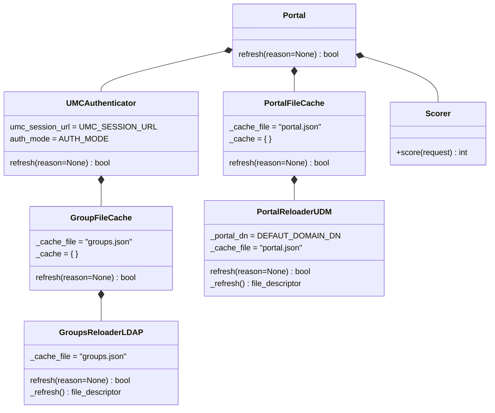
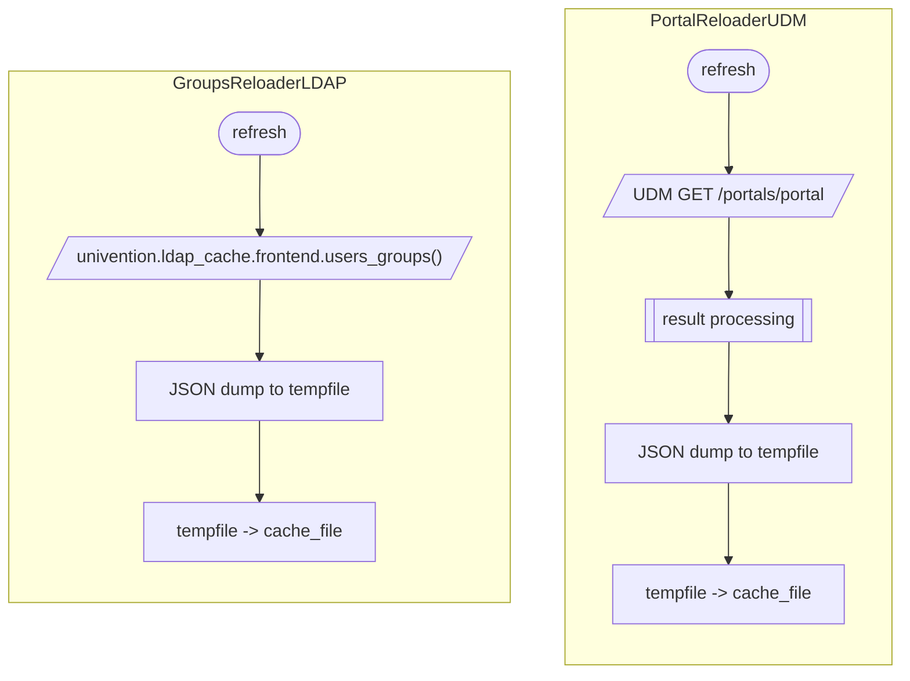
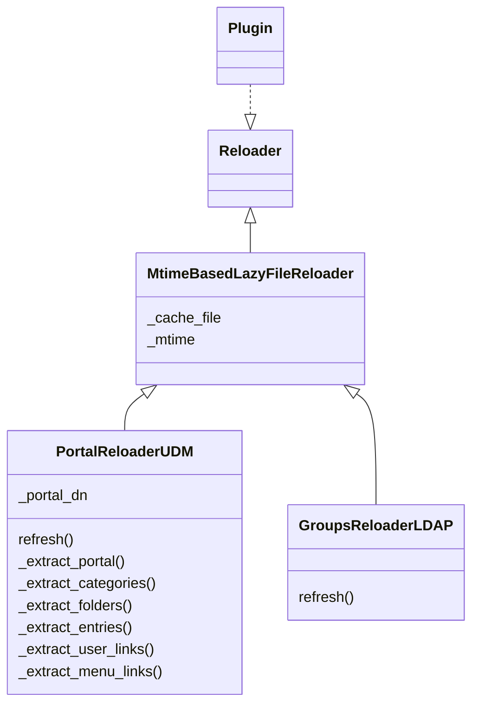

# Portal representation

## Portal class composition



??? abstract "Default class configuration (from CLI app)"

    ```yaml hl_lines="41 42 43 44 45 46 47 48 49 50 51 52"
    class: Portal
    kwargs:
      scorer:
        class: Scorer
        type: class
      portal_cache:
        class: PortalFileCache
        kwargs:
          cache_file:
            type: static
            value: "/var/cache/univention-portal/portal.json"
          reloader:
            class: PortalReloaderUDM
            kwargs:
              portal_dn:
                key: default_domain_dn
                type: config
              cache_file:
                type: static
                value: "/var/cache/univention-portal/portal.json"
            type: class
        type: class
      authenticator:
        class: UMCAuthenticator
        kwargs:
          auth_mode:
            key: auth_mode
            type: config
          umc_session_url:
            key: umc_session_url
            type: config
          group_cache:
            class: GroupFileCache
            kwargs:
              cache_file:
                type: static
                value: "/var/cache/univention-portal/groups.json"
              reloader:
                class: GroupsReloaderLDAP
                kwargs:
                  ldap_uri:
                    key: ldap_uri
                    type: config
                  binddn:
                    key: hostdn
                    type: config
                  password_file:
                    type: static
                    value: "/etc/machine.secret"
                  ldap_base:
                    key: ldap_base
                    type: config
                  cache_file:
                    type: static
                    value: "/var/cache/univention-portal/groups.json"
                type: class
            type: class
        type: class
    type: class
    ```

??? abstract "JSON response from `/portal.json` (demo data from frontend code)"

    ```yaml
    user_links:
    - cn=self-service-password-change,cn=entry,cn=portals,cn=univention,dc=intranet,dc=portal,dc=de
    menu_links:
    - cn=certificates,cn=folder,cn=portals,cn=univention,dc=intranet,dc=portal,dc=de
    - cn=folder,cn=folder,cn=portals,cn=univention,dc=intranet,dc=portal,dc=de
    - cn=help,cn=folder,cn=portals,cn=univention,dc=intranet,dc=portal,dc=de
    - cn=owncloud-admindoc,cn=entry,cn=portals,cn=univention,dc=intranet,dc=portal,dc=de
    - cn=univentionblog,cn=entry,cn=portals,cn=univention,dc=intranet,dc=portal,dc=de
    entries:
    - activated: true
      allowedGroups:
      - cn=Domain Users,cn=groups,dc=intranet,dc=portal,dc=de
      anonymous: false
      backgroundColor:
      description:
        de_DE: Ihr Passwort ändern
        en_US: Change your password
      dn: cn=self-service-password-change,cn=entry,cn=portals,cn=univention,dc=intranet,dc=portal,dc=de
      in_portal: true
      linkTarget: samewindow
      links:
      - locale: en_US
        value: "#/selfservice/passwordchange"
      keywords: {}
      logo_name:
      name:
        de_DE: Passwort ändern
        en_US: Change password
    - activated: true
      allowedGroups: []
      anonymous: false
      backgroundColor:
      description:
        de_DE: Wurzelzertifikat
        en_US: Root certificate
      dn: cn=root-cert,cn=entry,cn=portals,cn=univention,dc=intranet,dc=portal,dc=de
      linkTarget: samewindow
      links:
      - locale: de_DE
        value: "/ucs-root-ca-de.crt"
      - locale: en_US
        value: "/ucs-root-ca-en.crt"
      keywords: {}
      logo_name:
      name:
        de_DE: Wurzelzertifikat
        en_US: Root certificate
    - activated: true
      allowedGroups: []
      anonymous: false
      backgroundColor:
      description:
        de_DE: Zertifikat-Sperrliste
        en_US: Certificate revocation list
      dn: cn=certificate-revocation,cn=entry,cn=portals,cn=univention,dc=intranet,dc=portal,dc=de
      linkTarget: samewindow
      links:
      - locale: en_US
        value: "/ucsCA.crl"
      keywords: {}
      logo_name:
      name:
        de_DE: Zertifikat-Sperrliste
        en_US: Certificate revocation list
    - activated: true
      allowedGroups: []
      anonymous: false
      backgroundColor:
      description:
        de_DE: ownCloud Administrations-Handbuch (in Englisch)
      dn: cn=owncloud-admindoc,cn=entry,cn=portals,cn=univention,dc=intranet,dc=portal,dc=de
      linkTarget: useportaldefault
      links:
      - locale: en_US
        value: https://doc.owncloud.com/server/10.0/admin_manual/
      - locale: de_DE
        value: https://doc.owncloud.com/server/10.0/admin_manual/
      keywords: {}
      logo_name: "./data/icons/owncloud-admindoc.svg"
      name:
        de_DE: Admin Handbuch
        en_US: Admin Handbook
      target: docs
    - activated: true
      allowedGroups: []
      anonymous: false
      backgroundColor:
      description:
        de_DE: ownCloud Benutzer-Handbuch (in Englisch)
        en_US: ownCloud User Manual
      dn: cn=owncloud-userdoc,cn=entry,cn=portals,cn=univention,dc=intranet,dc=portal,dc=de
      linkTarget: useportaldefault
      links:
      - locale: en_US
        value: https://doc.owncloud.com/server/10.0/user_manual/
      keywords: {}
      logo_name: "./data/icons/owncloud-userdoc.svg"
      name:
        de_DE: Benutzer Handbuch
        en_US: User Manual
      target: docs
    - activated: true
      allowedGroups: []
      anonymous: false
      backgroundColor:
      description:
        de_DE: Univention Management Console zur Ver­wal­tung der UCS-Domäne und des lokalen
          Systems
        en_US: Univention Management Console for admin­is­tra­ting the UCS domain and
          the local system
        fr_FR: Console de gestion Univention pour admin­is­trer le domaine UCS et le système
          local
      dn: cn=umc-domain,cn=entry,cn=portals,cn=univention,dc=intranet,dc=portal,dc=de
      linkTarget: newwindow
      links:
      - locale: en_US
        value: "/univention/management/"
      keywords: {}
      logo_name: "./data/icons/umc-domain.svg"
      name:
        de_DE: System- und Domäneneinstellungen
        en_US: System and domain settings
        fr_FR: Réglages du système et du domaine
    - activated: true
      allowedGroups: []
      anonymous: false
      backgroundColor:
      description:
        de_DE: News, Tipps und Best Practices
        en_US: News, tips and best practices
        fr_FR: Nouvelles, conseils et bonne pratique
      dn: cn=univentionblog,cn=entry,cn=portals,cn=univention,dc=intranet,dc=portal,dc=de
      keywords:
        en_US: key
        de_DE: word
      linkTarget: newwindow
      links:
      - locale: de_DE
        value: https://www.univention.de/news/blog-de
      - locale: en_US
        value: https://www.univention.com/news/blog-en
      logo_name: "./data/icons/univentionblog.png"
      name:
        de_DE: Univention Blog
        en_US: Univention Blog
        fr_FR: Univention Blog
    - activated: true
      allowedGroups: []
      anonymous: false
      backgroundColor:
      description:
        de_DE: Feedback
        en_US: Feedback
        fr_FR: Impressions
      dn: cn=univentionfeedback,cn=entry,cn=portals,cn=univention,dc=intranet,dc=portal,dc=de
      linkTarget: newwindow
      links:
      - locale: en_US
        value: https://www.univention.de/produkt-feedback/?umc=portal
      - locale: en_US
        value: https://www.univention.com/feedback/?umc=portal
      keywords: {}
      logo_name:
      name:
        de_DE: Feedback
        en_US: Feedback
        fr_FR: Impressions
    - activated: true
      allowedGroups: []
      anonymous: false
      backgroundColor:
      description:
        de_DE: Univention Forum "Hilfe"
        en_US: Univention Forum "Help"
      dn: cn=univentionforum,cn=entry,cn=portals,cn=univention,dc=intranet,dc=portal,dc=de
      linkTarget: newwindow
      links:
      - locale: en_US
        value: https://help.univention.com
      keywords: {}
      logo_name:
      name:
        de_DE: Univention Forum "Hilfe"
        en_US: Univention Forum "Help"
    - activated: true
      allowedGroups: []
      anonymous: false
      backgroundColor:
      description:
        de_DE: Univention Webseite
        en_US: Univention Website
        fr_FR: Site Internet Univention
      dn: cn=univentionwebsite,cn=entry,cn=portals,cn=univention,dc=intranet,dc=portal,dc=de
      linkTarget: newwindow
      links:
      - locale: de_DE
        value: https://www.univention.de
      - locale: en_US
        value: https://www.univention.com
      keywords: {}
      logo_name:
      name:
        de_DE: Univention Webseite
        en_US: Univention Website
        fr_FR: Site Internet Univention
    folders:
    - dn: cn=folder,cn=folder,cn=portals,cn=univention,dc=intranet,dc=portal,dc=de
      entries:
      - cn=owncloud-admindoc,cn=entry,cn=portals,cn=univention,dc=intranet,dc=portal,dc=de
      - cn=univentionblog,cn=entry,cn=portals,cn=univention,dc=intranet,dc=portal,dc=de
      - cn=univentionblog,cn=entry,cn=portals,cn=univention,dc=intranet,dc=portal,dc=de
      - cn=univentionblog,cn=entry,cn=portals,cn=univention,dc=intranet,dc=portal,dc=de
      - cn=univentionblog,cn=entry,cn=portals,cn=univention,dc=intranet,dc=portal,dc=de
      - cn=univentionblog,cn=entry,cn=portals,cn=univention,dc=intranet,dc=portal,dc=de
      - cn=univentionblog,cn=entry,cn=portals,cn=univention,dc=intranet,dc=portal,dc=de
      - cn=univentionblog,cn=entry,cn=portals,cn=univention,dc=intranet,dc=portal,dc=de
      - cn=univentionblog,cn=entry,cn=portals,cn=univention,dc=intranet,dc=portal,dc=de
      - cn=univentionblog,cn=entry,cn=portals,cn=univention,dc=intranet,dc=portal,dc=de
      - cn=univentionblog,cn=entry,cn=portals,cn=univention,dc=intranet,dc=portal,dc=de
      name:
        de_DE: Apps
        en_US: Apps
    - dn: cn=certificates,cn=folder,cn=portals,cn=univention,dc=intranet,dc=portal,dc=de
      entries:
      - cn=root-cert,cn=entry,cn=portals,cn=univention,dc=intranet,dc=portal,dc=de
      - cn=certificate-revocation,cn=entry,cn=portals,cn=univention,dc=intranet,dc=portal,dc=de
      name:
        de_DE: Zertifikate
        en_US: Certificates
    - dn: cn=help,cn=folder,cn=portals,cn=univention,dc=intranet,dc=portal,dc=de
      entries:
      - cn=univentionforum,cn=entry,cn=portals,cn=univention,dc=intranet,dc=portal,dc=de
      - cn=univentionfeedback,cn=entry,cn=portals,cn=univention,dc=intranet,dc=portal,dc=de
      - cn=univentionblog,cn=entry,cn=portals,cn=univention,dc=intranet,dc=portal,dc=de
      - cn=univentionwebsite,cn=entry,cn=portals,cn=univention,dc=intranet,dc=portal,dc=de
      name:
        de_DE: Hilfe
        en_US: Help
        fr_FR: Aide
    categories:
    - display_name:
        de_DE: Verwaltung
        en_US: Administration
      dn: cn=domain-admin,cn=category,cn=portals,cn=univention,dc=intranet,dc=portal,dc=de
      entries:
      - cn=umc-domain,cn=entry,cn=portals,cn=univention,dc=intranet,dc=portal,dc=de
      - cn=univentionblog,cn=entry,cn=portals,cn=univention,dc=intranet,dc=portal,dc=de
      - cn=owncloud-userdoc,cn=entry,cn=portals,cn=univention,dc=intranet,dc=portal,dc=de
      - cn=owncloud-admindoc,cn=entry,cn=portals,cn=univention,dc=intranet,dc=portal,dc=de
    - display_name:
        de_DE: Applikationen
        en_US: Applications
      dn: cn=domain-service,cn=category,cn=portals,cn=univention,dc=intranet,dc=portal,dc=de
      entries:
      - cn=folder,cn=folder,cn=portals,cn=univention,dc=intranet,dc=portal,dc=de
    portal:
      background:
      categories:
      - cn=domain-service,cn=category,cn=portals,cn=univention,dc=intranet,dc=portal,dc=de
      - cn=domain-admin,cn=category,cn=portals,cn=univention,dc=intranet,dc=portal,dc=de
      defaultLinkTarget: embedded
      dn: cn=domain,cn=portal,cn=portals,cn=univention,dc=intranet,dc=portal,dc=de
      ensureLogin: false
      showUmc: true
      logo: "./data/icons/logo.svg"
      name:
        de_DE: Univention Portal DE
        en_US: Univention Portal EN
        fr_FR: Portail Univention FR
      content:
      - - cn=domain-service,cn=category,cn=portals,cn=univention,dc=intranet,dc=portal,dc=de
        - - cn=folder,cn=folder,cn=portals,cn=univention,dc=intranet,dc=portal,dc=de
      - - cn=domain-admin,cn=category,cn=portals,cn=univention,dc=intranet,dc=portal,dc=de
        - - cn=umc-domain,cn=entry,cn=portals,cn=univention,dc=intranet,dc=portal,dc=de
          - cn=univentionblog,cn=entry,cn=portals,cn=univention,dc=intranet,dc=portal,dc=de
          - cn=owncloud-userdoc,cn=entry,cn=portals,cn=univention,dc=intranet,dc=portal,dc=de
          - cn=owncloud-admindoc,cn=entry,cn=portals,cn=univention,dc=intranet,dc=portal,dc=de
    filtered: true
    may_edit_portal: true
    auth_mode: ucs
    cache_id: abc:123
    username: administrator
    user_displayname: Administrator
    ```

## Cache mechanism

Backend needs to cache computationally expensive results.

!!! note
    
    Only cache mechanism available at this point is filesystem.

    - /var/cache/univention/portal.json
    - /var/cache/univention/groups.json



### Reloader class hierarchy


