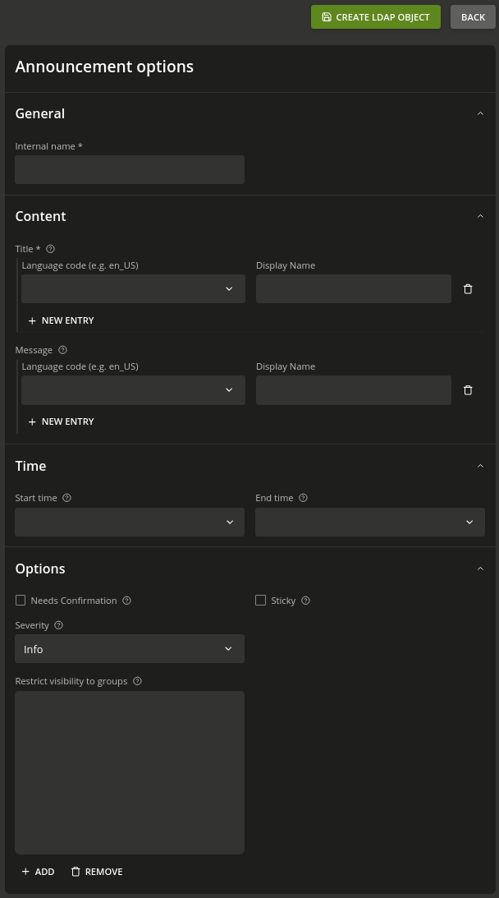

# Announcements

## Properties

| Property Name       | Description                                                                                                     |
|---------------------|-----------------------------------------------------------------------------------------------------------------|
| `allowedGroups`     | A list of LDAP groups that are able to see the announcement                                                     |
| `isSticky`          | If `true`, the announcement cannot be hidden by the user                                                        |
| `message`           | A localized message to add more details to the announcement                                                     |
| `name`              | A unique identifier of the announcement                                                                         |
| `needsConfirmation` | If `true`, the user is required to confirm the announcement (currently not supported!)                          |
| `severity`          | Can be one of `info`, `success`, `warn` or `danger` to indicate the severity with a different background color  |
| `visibleFrom`       | An ISO formated date string that indicates the earliest date an announcement is visible                         |
| `visibleUntil`      | An ISO formated date string that indicates the latest date an announcement is visible                           |
| `title`             | A localized title of the announcement                                                                           |

## Creation

### Univention Directory Manager CLI

Create an announcement by calling `udm create` as follows:

```sh
udm portals/announcement create \
  --position "cn=announcement,cn=portals,cn=univention,$(ucr get ldap/base)" \
  --set name="Testannouncment" \
  --append title='"en_US" "Test announcement"'	\
  --append message='"en_US" "This is an announcement for testing purposes"' \
  --set severity="warn" \
  --set needsConfirmation=FALSE \
  --set isSticky=TRUE \
  --set visibleFrom="2022-12-21" \
  --set visibleUntil="2022-12-24"
```

### Univention Portal Web Frontend

Log in as user *Administrator* and navigate to **Univention Management Console** > **Domain**.

Click on **LDAP directory** and navigate to **univention** > **portals** > **announcement**.

Click on **+ ADD** and chose **Portal: Announcement** and you will be presented with the following form:



The options you can chose are the same as documented above.

## Customizing Background Color for Severity

CSS styles for the severity are defined as follows.

```css
  --bgc-announcements-info: var(--color-accent);
  --bgc-announcements-danger: var(--bgc-error);
  --bgc-announcements-success: var(--bgc-success);
  --bgc-announcements-warn: var(--bgc-warning);
```

By default, they are refering to existing severity styles. In order to modify them, you need to override them in
`/usr/share/univention-portal/css/custom.css` by adding something like:

```css
:root {
  --bgc-announcements-info: #aaa; /** chose your preferred colors here */
  --bgc-announcements-danger: #f22;
  --bgc-announcements-success: #2f2;
  --bgc-announcements-warn: #ff2;
}
```

## Known limitations

1. There is no error message when defining an end date that is earlier than the start date. Instead the announcement is shown.
2. `visibleFrom` and `visibleUntil` properties are handled as ISO datetimes internally, but only accept dates in the UDM form widgets, currently.
3. The `needsConfirmation` property is currently ignored
4. Hiding an announcement by clicking the **X** icon is stored in the local browser store.
5. After creating an announcement, a refresh of the browser page is necessary to display the announcement.
