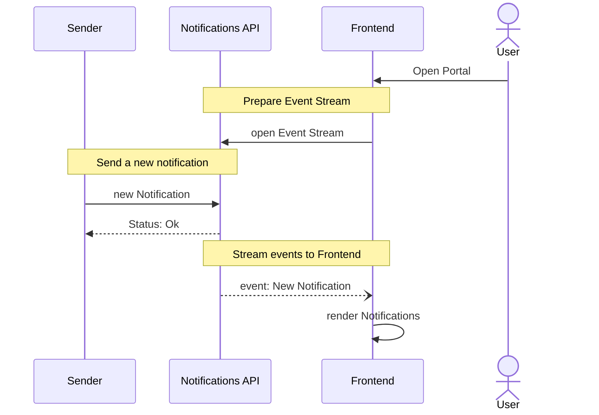
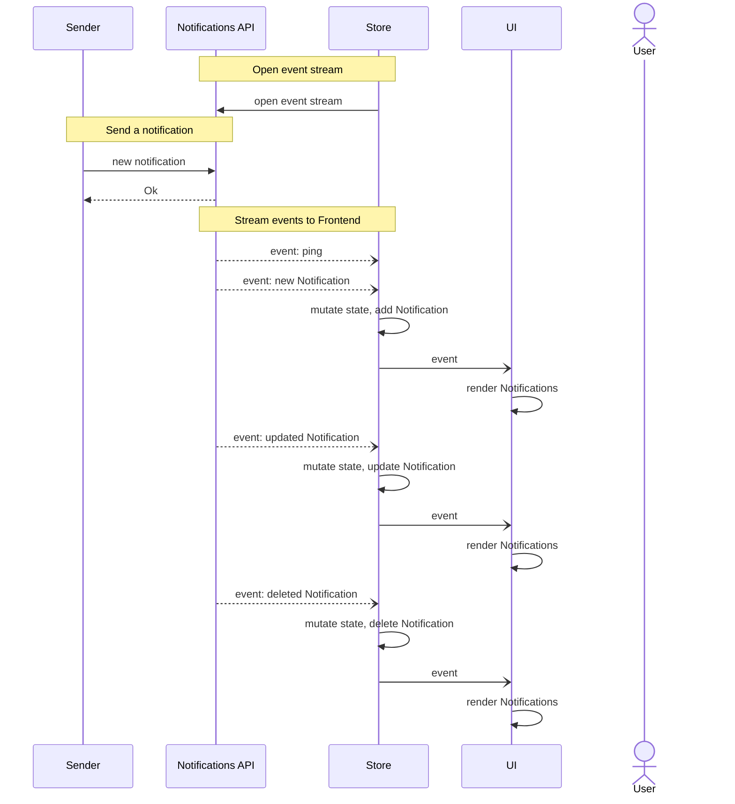

# Sender Communication

## Interaction examples

### Sent notification is received by the user

#### High level view

```mermaid
sequenceDiagram

    participant Sender
    participant notifications_api as Notifications API
    participant Store as Frontend
    actor User

    User ->> Store: Open Portal

    Note over notifications_api, Store: Prepare Event Stream
    Store ->> notifications_api: open Event Stream

    Note over Sender, notifications_api: Send a new notification

    Sender ->> notifications_api: new Notification
    notifications_api -->> Sender: Status: Ok

    Note over notifications_api, Store: Stream events to Frontend

    notifications_api --) Store: event: New Notification
    Store ->> Store: render Notifications
```

#### Detailed view

```mermaid

sequenceDiagram

    participant Sender
    participant notifications_api as Notifications API
    participant Store
    participant UI
    actor User

    Note over notifications_api, Store: Open event stream
    Store ->> notifications_api: open event stream

    Note over Sender, notifications_api: Send a notification

    Sender ->> notifications_api: new notification
    notifications_api -->> Sender: Ok

    Note over notifications_api, Store: Stream events to Frontend

    notifications_api --) Store: event: ping

    notifications_api --) Store: event: new Notification
    Store ->> Store: mutate state, add Notification
    Store -) UI: event
    UI ->> UI: render Notifications

    notifications_api --) Store: event: updated Notification

    Store ->> Store: mutate state, update Notification
    Store -) UI: event
    UI ->> UI: render Notifications

    notifications_api --) Store: event: deleted Notification

    Store ->> Store: mutate state, delete Notification
    Store -) UI: event
    UI ->> UI: render Notifications

```
