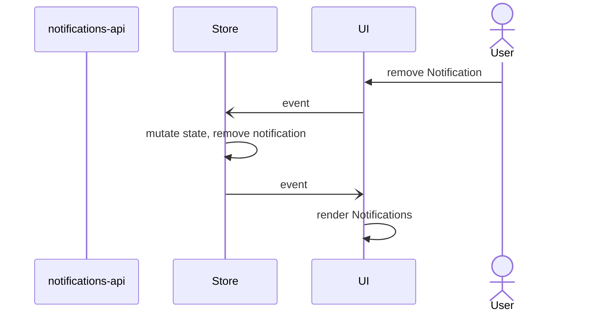
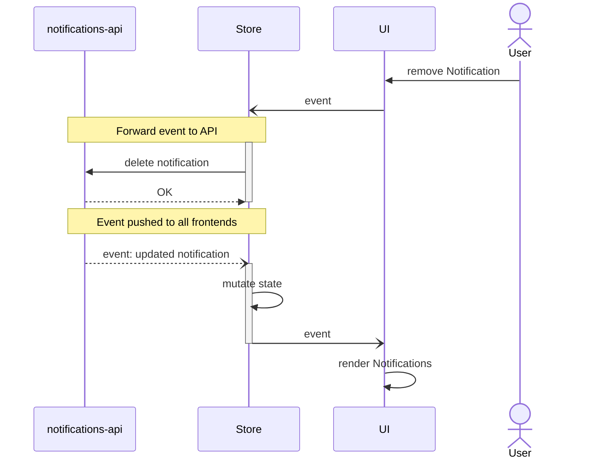
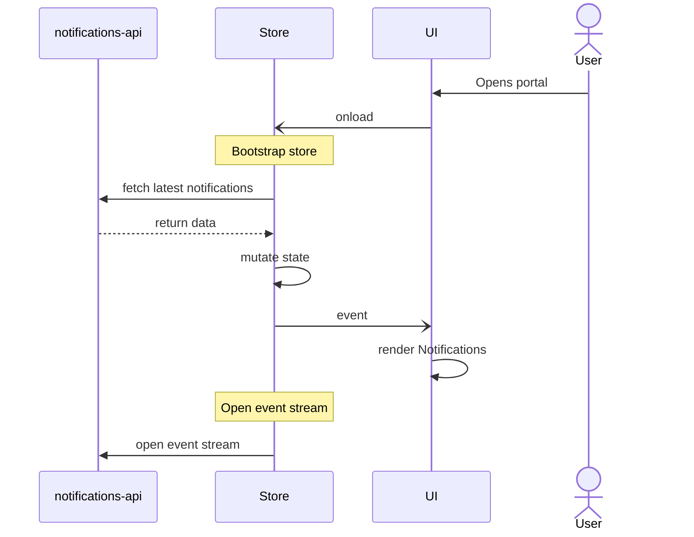
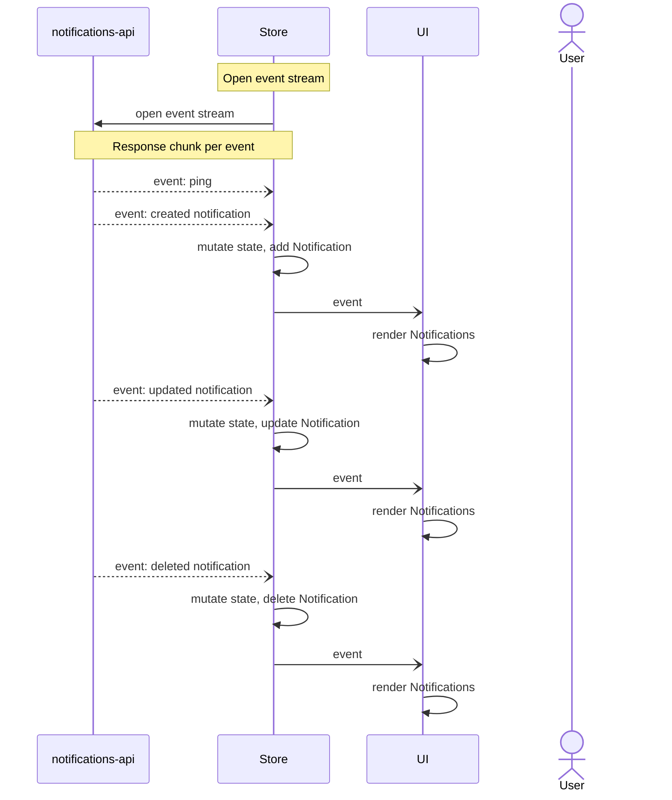
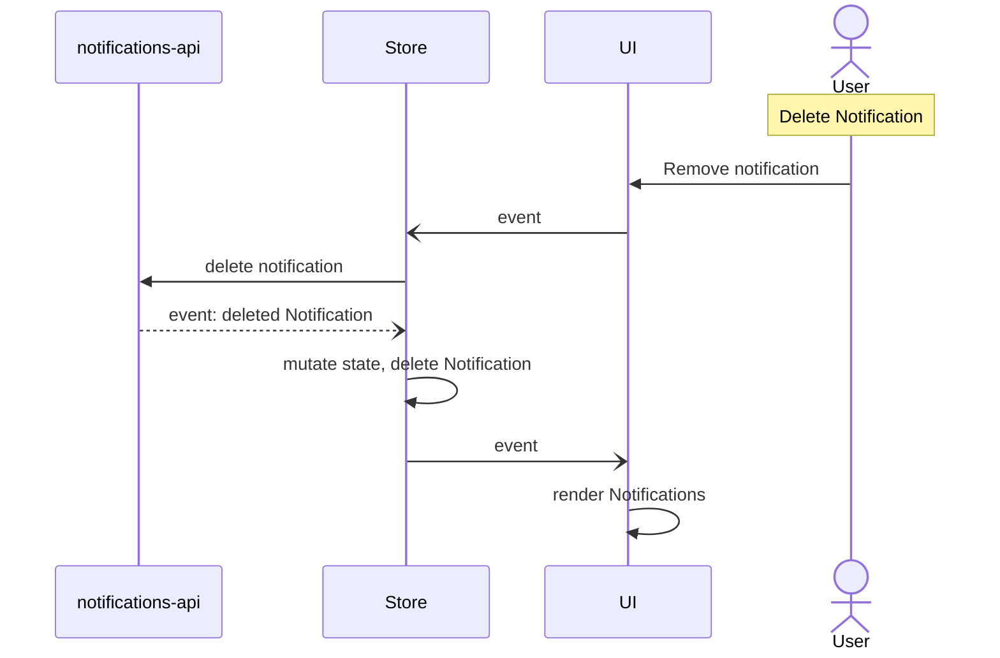
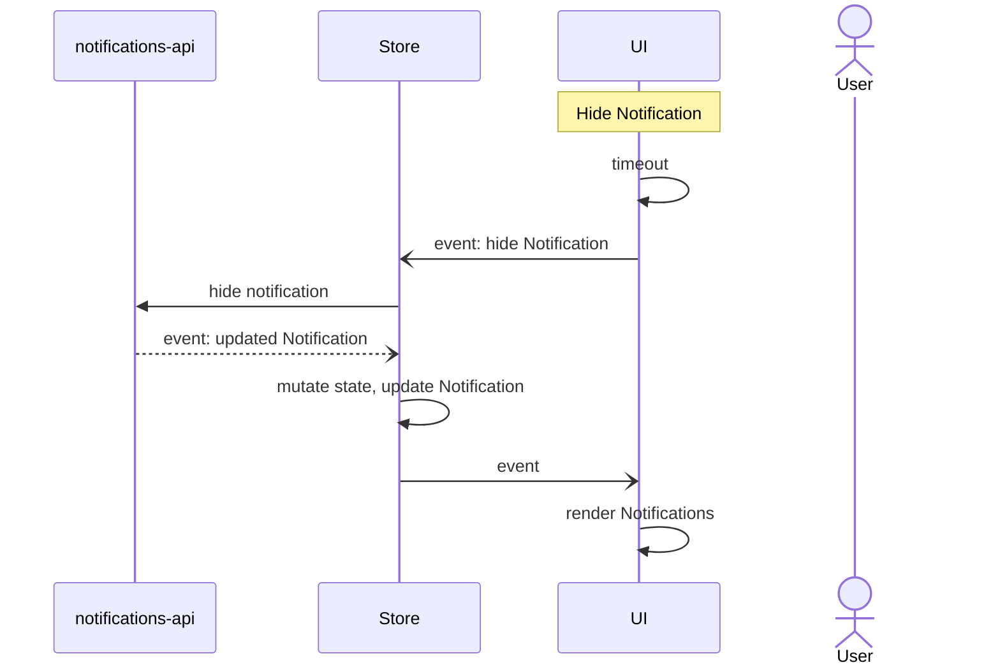

# Technical design

## Guiding assumptions

- Keep BackendNotifications and LocalNotifications apart from each other,
  esp. within the store
- BackendNotifications are integrated with the notification-api so that
  "store.backendNotifications" does reflect the state of the backend.
- Distinguish "UI" from "Store"
- The UI does render all notifications from the Store.
- When the UI asks the Store to get all notifications, then the Store
  returns a list which is made by concatenating "store.notifiations"
  and "store.backendNotifications".
- No smart sorting will be implemented. (avoid efforts, and take Ingo's mail
  into account).

## State mutation pattern

### No backend state

Usually in the frontend, we see the following approach:

1. All changes are introduced by triggering an event (dispatch).
2. The event handler on the `Store` triggers a mutation.
3. Changes of the `Store` do then trigger events for the UI, so that components
   are rendered again where needed.

### Backend state as in BackendNotifications

The difference is that the `Store` does not "own" the whole state anymore. The
backend state is now "owned" by the `notifications_api` and this adds one extra
layer around the event handling.

1. All changes are introduced by triggering an event (dispatch).
2. The event handler on the `Store` does then "forward" the event to the
   `notifications_api` if the affected object is owned by the
   `notifications_api`. Technically the event is forwarded via an HTTP request.
3. The `notifications_api` then internally updates it's state. And this does
   trigger internal events.
4. The `notifications_api` does deliver this event to the event stream, so that
   all frontends of this user will receive the update event.
5. The `Store` in the frontend receives the event out of the `EventSource` and
   now it mutates the state in the `Store`.
6. Changes of the `Store` do then trigger events for the UI, so that components
   are rendered again where needed.

## Special cases and corner cases

A few cases need special consideration due to the change into a distributed
system. State management and event handling can otherwise get out of sync and
cause subtle issues.

### Fetch latest notifications and starting the event stream

Since we have two asynchronous requests for both actions, we cannot know if
there were new notifications introduced between fetching the latest
notifications and starting the event stream.

This can lead to race conditions happening occasionally which would lead to very
difficult to understand bugs.

#### State

Needs decision.

Preferred solution: Remove the call to fetch the latest notifications, and
extend the event stream endpoint, so that it can stream the relevant events
again for the latest X notifications. This avoids the issue.

#### Current implementation

Currently the implementation does flag notifications as seen when they are
streamed out as event or fetched via a request to retrieve the latest
notifications.

#### Option: Token

Starting the event stream could accept a Token as query parameter. If given,
then the API would ensure that for everything after this Token an event would be
generated.

The Token would be in included in the response of the request to fetch the
latest notifications.

#### Option: Avoid the request to fetch latest notifications

An alternative could be to avoid the call to fetch the latest notifications at
all. Instead the frontend would open up the event stream and via a query
parameter request the last X notifications as well.

The API would ensure to re-generate the events in the right order, so that all
notifications are in the frontend.

This avoids the problem.

## Interaction sequence examples

The following examples show various aspects of the interaction patterns as a
sequence.

### User opens the portal

The frontend does two things:

1. The `Store` loads the latest BackendNotifications from the API
2. The `Store` connects to the event stream.

Hint: Client side `EventSource` is used, see
https://developer.mozilla.org/en-US/docs/Web/API/EventSource

### Events are pushed to the frontend

Each event is handled by the `Store` and the state within the `Store` is mutated
based on the type and data of the event.

### CLARIFY -- User deletes a BackendNotification

The key is, that the event only triggers a request to the `notifications_api`.

Due to this API call the `Store` will get a push event with the deleted
notification.

This way we avoid any smart logic in the frontend.

### CLARIFY -- A popup notification has been hidden automatically

The key is, that the event only triggers a request to the `notifications_api`.
Same as delete above.

