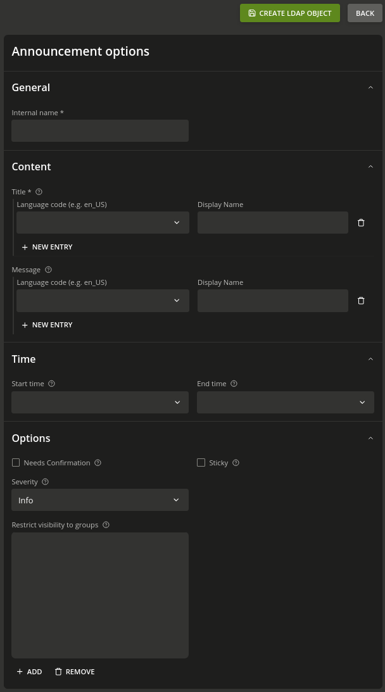

# Announcements

## Properties

| Property Name       | Description                                                                                                     |
|---------------------|-----------------------------------------------------------------------------------------------------------------|
| `allowedGroups`     | A list of LDAP groups that are able to see the announcement                                                     |
| `endTime`           | An ISO formated time string that indicates the latest time an announcement is visible                           |
| `isSticky`          | If `true`, the announcement cannot be hidden by the user                                                        |
| `message`           | A localized message to add more details to the announcement                                                     |
| `name`              | A unique identifier of the announcement                                                                         |
| `needsConfirmation` | If `true`, the user is required to confirm the announcement (currently not supported!)                          |
| `severity`          | Can be one of `info`, `success`, `warn` or `danger` to indicate the severity with a different background color  |
| `startTime`         | An ISO formated time string that indicates the earliest time an announcement is visible                         |
| `title`             | A localized title of the announcement                                                                           |

> NOTE: Even though, it is named start and end *time*, currently only dates are respected by the application.

## Creation

### Univention Directory Manager CLI

Create an announcement by calling `udm create` as follows:

```sh
udm portals/announcement create \
  --position "cn=announcement,cn=portals,cn=univention,$(ucr get ldap/base)" \
  --set name="Testannouncment" \
  --append title='"de_DE" "Test-Announcement ohne Gruppeneinschränkung"'	\
  --append message='"de_DE" "Dies ist ein Testannouncement das für jeden User, d.h. auch ohne Login sichtbar sein sollte"' \
  --set severity="warn" \
  --set needsConfirmation=FALSE \
  --set isSticky=TRUE \
  --set startTime="2022-12-21" \
  --set endTime="2022-12-24"
```

### Univention Portal Web Frontend

Log in as user *Administrator* and navigate to **Univention Management Console** > **Domain**.

Click on **LDAP directory** and navigate to **univention** > **portals** > **announcement**.

Click on **+ ADD** and chose **Portal: Announcement** and you will be presented with the following form:



The options you can chose are the same as documented above.

## Customizing Background Color for Severity

CSS styles for the severity are defined as follows.

```css
  --bgc-announcements-info: var(--color-accent);
  --bgc-announcements-danger: var(--bgc-error);
  --bgc-announcements-success: var(--bgc-success);
  --bgc-announcements-warn: var(--bgc-warning);
```

By default, they are refering to existing severity styles. In order to modify them, you need to override them in
`/usr/share/univention-portal/css/custom.css` by adding something like:

```css
:root {
  --bgc-announcements-info: #aaa; /** chose your preferred colors here */
  --bgc-announcements-danger: #f22;
  --bgc-announcements-success: #2f2;
  --bgc-announcements-warn: #ff2;
}
```

## Known limitations

1. There is no error message when defining an end time that is earlier than the start date. Instead the announcement is shown.
2. Start and end time of an announcement are rather start and end dates.
3. The `needsConfirmation` property is currently ignored
4. Hiding an announcement by clicking the **X** icon is stored in the local browser store.
5. After creating an announcement, a refresh of the browser page is necessary to display the announcement.