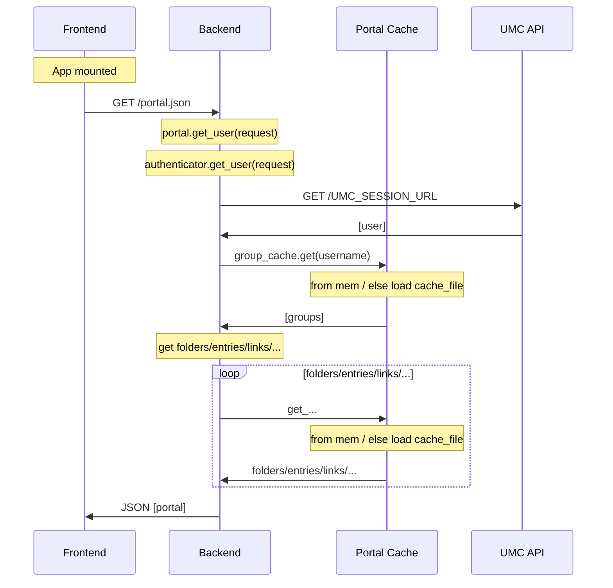

# Cache mechanism and listener updates

Backend needs to cache computationally expensive results.

!!! note

    Only cache mechanism available at this point is filesystem.

    - /var/cache/univention/portal.json
    - /var/cache/univention/groups.json

## Loading portal entries

## Reloader process

## Reloader class hierarchy

