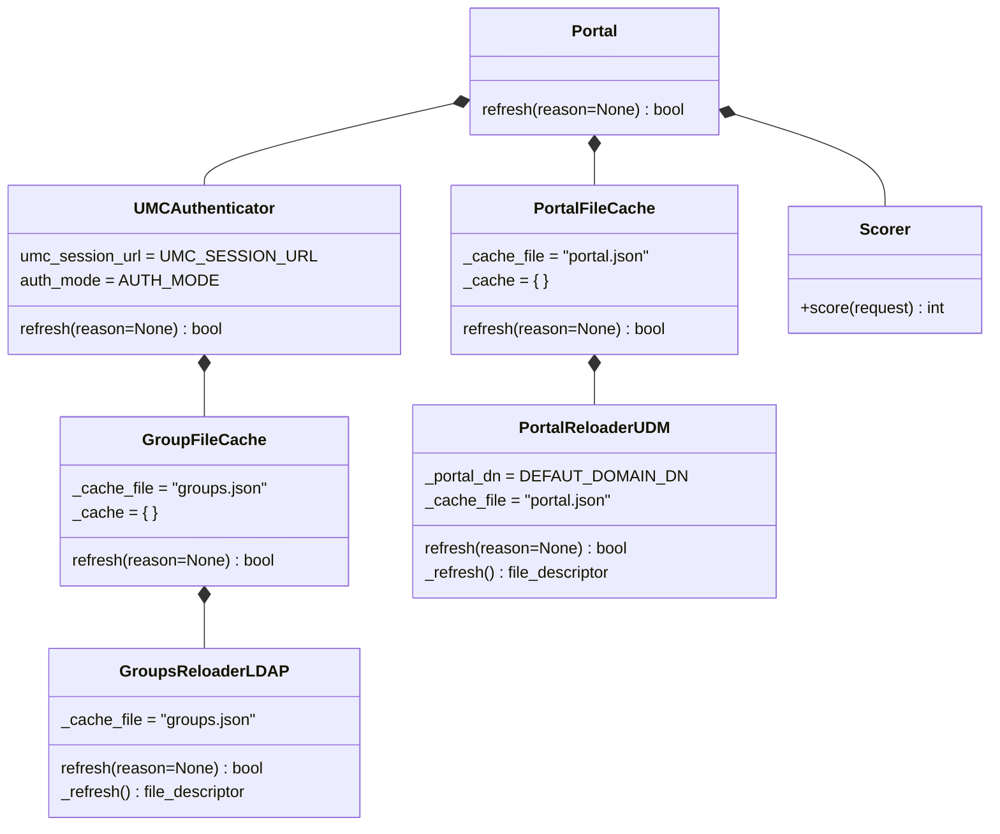

# Portal backend

## Portal class composition

The specific class composition for the main Portal class running in the portal-server process is defined via a textfile that is loaded when the server starts up.

The file is located at `/usr/share/univention-portal/portals.json`.

The following diagram shows the composition in the default case.

