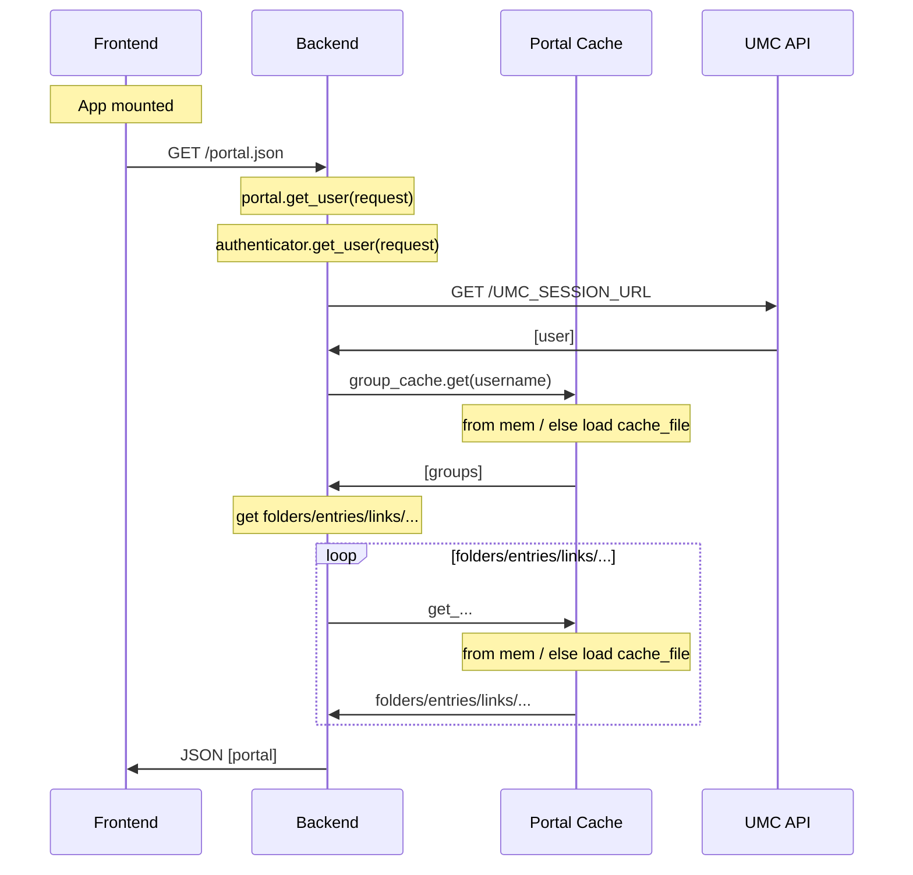
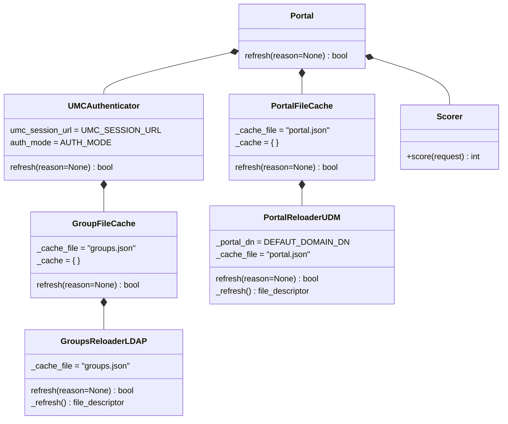

# Portal backend

## Loading portal entries

```mermaid
sequenceDiagram
    participant F as Frontend
    participant B as Backend
    participant C as Portal Cache
    participant U as UMC API
    Note over F: App mounted
    F ->> B: GET /portal.json
    Note over B: portal.get_user(request)
    Note over B: authenticator.get_user(request)
    B ->> U: GET /UMC_SESSION_URL
    U ->> B: [user]
    B ->> C: group_cache.get(username)
    Note over C: from mem / else load cache_file
    C ->> B: [groups]
    Note over B: get folders/entries/links/...
    loop folders/entries/links/...
        B ->> C: get_...
        Note over C: from mem / else load cache_file
        C ->> B: folders/entries/links/...
    end
    B ->> F: JSON [portal]
```

## Portal class composition

```mermaid
classDiagram
    GroupFileCache *-- GroupsReloaderLDAP
    UMCAuthenticator *-- GroupFileCache
    PortalFileCache *-- PortalReloaderUDM
    Portal *-- UMCAuthenticator
    Portal *-- PortalFileCache
    Portal *-- Scorer
    class Portal{
        refresh(reason=None) bool
    }
    class UMCAuthenticator{
        umc_session_url = UMC_SESSION_URL
        auth_mode = AUTH_MODE
        refresh(reason=None) bool
    }
    class PortalFileCache{
        _cache_file = "portal.json"
        _cache = &#123 &#125
        refresh(reason=None) bool
    }
    class GroupFileCache{
        _cache_file = "groups.json"
        _cache = &#123 &#125
        refresh(reason=None) bool
    }
    class PortalReloaderUDM{
        _portal_dn = DEFAUT_DOMAIN_DN
        _cache_file = "portal.json"
        refresh(reason=None) bool
        _refresh() file_descriptor
    }
    class GroupsReloaderLDAP{
        _cache_file = "groups.json"
        refresh(reason=None) bool
        _refresh() file_descriptor
    }
    class Scorer{
        +score(request) int
    }
```
