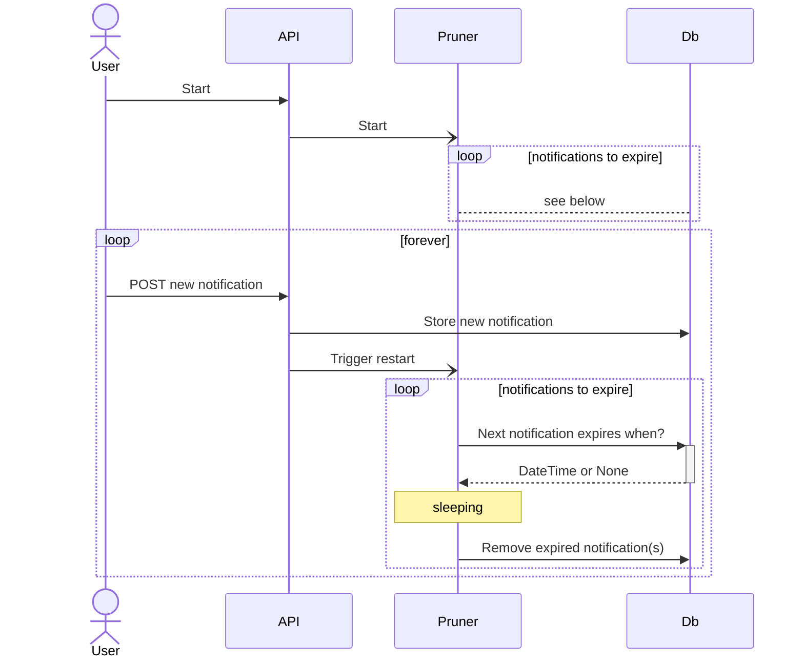

## Pruning expired notifications

The server runs both the FastAPI-based event handler,
and a pruning job for removing expired events.

The pruning job is sleeping until the next notification is supposed to expire.
It is restarted whenever a new notification is submitted, in order to update the sleep time.
When no notifications are left to expire, the job ends.

In addition, each `/GET` request filters the response for
non-expired notifications.

The benefits of this approach are:
- We do not have to rely on (or set up) procedures on the persistence layer.
- We do not have to set up additional house-keeping tasks (such as cronjobs).
- The pruner task is sleeping as much as possible.
- We do not need to call `DELETE` on the db at every `GET` request.
- For each `GET` request, the `SELECT` query will not have to do much filtering
  - Ideally we would need no filtering at this point.
  - However, there are edge-cases when running multiple instances of the service.

    Each service only knows about the next notification to expire and then goes to sleep.
    If another instance creates a soon-to-expire notification, and then that instance dies,
    the other instances will not know about it.
    Hence, we need some filtering on the `GET` endpoint.
    That notification will be picked up by another instance, but only at a later time.

    **Note: At the moment the service does not support scaling. We will have to revisit this aspect in the future. **

  - Thus, the current implementation should allow multiple instances of the service,
    with minimal house-keeping overhead in each instance.
